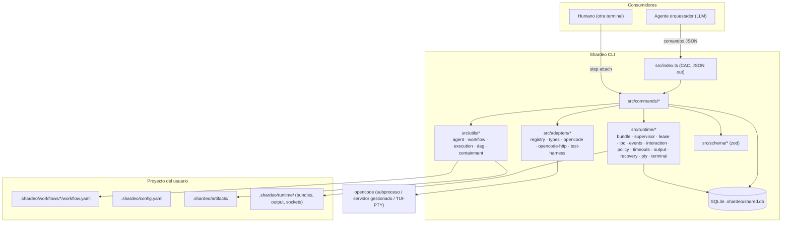
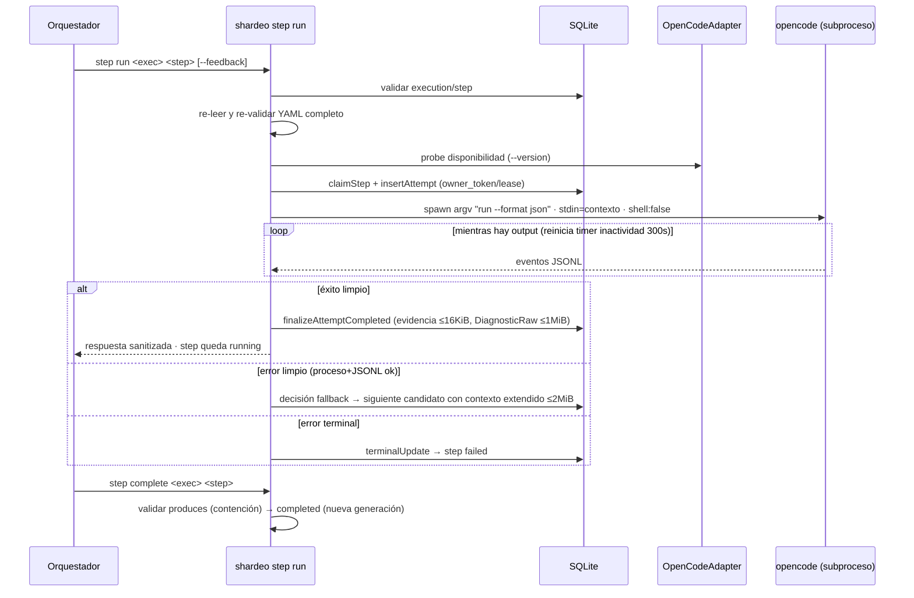

# Contexto del Proyecto — Shardeo

> Documento de referencia técnica generado a partir de la evidencia del repositorio (commit `0c813f7`, rama `main`, agosto de 2026). Su propósito es servir como fuente integral de contexto para desarrolladores y agentes LLM que trabajen sobre este proyecto, minimizando la exploración adicional.
>
> Convención usada en todo el documento: **(Hecho)** = verificado en el repositorio · **(Inferencia)** = deducción del análisis · **(Recomendación)** = sugerencia no respaldada por un pendiente explícito.

---

## 1. Resumen ejecutivo

**Shardeo** (v0.1.0, licencia MIT) es una herramienta CLI escrita en TypeScript que estructura y gestiona la ejecución de workflows de desarrollo de software asistidos por IA (Hecho: `package.json`, `README.md`, `AGENTS.md`).

No es un agente ni un IDE: no reemplaza a OpenCode, Codex CLI, Claude Code ni similares. Les da estructura: define qué ejecutar, con qué contexto, en qué orden y con qué runtime. Un **agente orquestador** (un LLM en un CLI como OpenCode) consume los comandos de Shardeo para avanzar por un workflow paso a paso; Shardeo valida el workflow, prepara e inyecta el contexto, invoca el runtime de agente, aplica políticas y persiste toda la evidencia de ejecución en SQLite (Hecho: `AGENTS.md`, `SPECS.md`).

- **Usuarios objetivo**: ingenieros y equipos que usan agentes de codificación y quieren procesos reproducibles, contexto consistente y trazabilidad completa (Hecho: `AGENTS.md` §Propuesta de valor).
- **Estado actual**: MVP funcional con las especificaciones funcionales 1–9 implementadas y entregadas en `main`; Spec 10 en borrador; la iniciativa 008 (incorporar Codex como segundo harness) está bloqueada esperando revisión humana (Hecho: `SPECS.md`, `.docs/initiatives/008-*/01-*/status.json`). Suite de tests: 550 casos, todos verdes en ejecución verificada; `tsc --noEmit` limpio (Hecho: verificación propia de este análisis).
- **Tamaño**: 50 archivos TypeScript en `src/` (~16.3k LOC), 87 archivos en `test/` (~74 suites referenciadas en el script `test`) (Hecho).

## 2. Objetivo y alcance

### Problema que resuelve
Los agentes de codificación carecen de estructura: cada invocación parte de cero, el contexto se pasa manualmente, no hay registro de qué se ejecutó ni con qué resultado, y las convenciones del equipo no se traducen en procesos reproducibles (Hecho: `AGENTS.md` §El problema que resuelve).

Shardeo separa tres responsabilidades: **metodología** (qué hacer: workflows), **conocimiento** (con qué contexto: skills/artefactos) y **ejecución** (quién lo hace: runtimes intercambiables vía adapters) (Hecho: `AGENTS.md`).

### Funcionalidades principales (implementadas)
1. Inicialización de proyecto (`shardeo init`) y estructura `.shardeo/`.
2. Descubrimiento de workflows (`workflows list/describe`) con validación Zod.
3. Ejecución de workflows como DAG dirigido por `depends_on` (`run`, `steps next`, `step run`, `step complete`).
4. Steps `command` (deterministas, auto-completados) y steps `agent` (vía runtime externo, hoy solo OpenCode).
5. Re-ejecución de steps con feedback (`--feedback`), fallback entre candidatos y contexto acumulado acotado.
6. Persistencia total en SQLite + reconciliación/reanudación (`resume`, `status`).
7. Control de iteración dirigido por el orquestador (`step reopen --cascade`, `step skip`) con generaciones de artefactos y auditoría.
8. Tres superficies de ejecución para steps agent (Spec 9): `headless`, `supervised` (supervisor local, permisos mediados, eventos con cursor, `step approve`) y `terminal` (PTY adjuntable con handoff humano, `step attach`).
9. Contexto reproducible por intento mediante *bundles* inmutables con manifiesto neutral (orden, límites, SHA-256).
10. Detección adapter-native de solicitudes de permiso (fixtures versionadas de OpenCode 1.17.18 + puente HTTP/SSE contra servidor gestionado de OpenCode 1.18.x).

### Fuera de alcance / no implementado
- **Interpretación semántica** de respuestas de agentes o decisiones de workflow: eso pertenece al orquestador (Hecho: `SPECS.md` §Principio de orquestación).
- **Segundo harness (Codex)**: iniciativa 008 bloqueada (Spec 01 headless) y su Spec 02 (app-server supervised) sin iniciar (Hecho: `.docs/initiatives/008-*`).
- **Spec 10** (override semántico de modelo/proveedor en `step run`): solo draft en `SPECS.md`, sin código (Hecho: `SPECS.md` líneas 1326+; no hay flags `--harness/--provider/--model/--variant` en `src/index.ts`).
- **Roadmap v2** descrito pero no implementado: registro explícito de CLIs en config, `shardeo doctor`, `shardeo setup` (Hecho: `AGENTS.md` §Futuro: v2).
- Paralelismo real: Shardeo informa qué steps son ejecutables; nunca ejecuta en paralelo por sí mismo (Hecho: `SPECS.md` Spec 5).

## 3. Estado actual del desarrollo

### Implementado (verificado en código + tests + git)
| Área | Evidencia |
|---|---|
| Init y estructura | `src/commands/init.ts`, `test/test-init.mjs` |
| Descubrimiento y validación de workflows | `src/utils/workflow.ts`, `src/schema/workflow.ts`, `test/test-workflows.mjs`, `test/workflow-schema.test.mjs` |
| DAG `depends_on` (Spec 5) | `src/utils/dag.ts`, `test/utils/dag-execution.test.mjs` |
| Steps command (Spec 3) | `src/utils/execution.ts`, `test/e2e/spec3-e2e.test.mjs` |
| Steps agent headless + fallback (Spec 4) | `src/utils/agent.ts`, `src/commands/steps.ts`, `test/agent-contract/lifecycle/fallback/snapshot.test.mjs` |
| Re-ejecución con feedback (Spec 6) | migración `migrateSpec6`, `test/re-execution.test.mjs` |
| Persistencia y resume (Spec 7) | `src/db/queries.ts`, `src/commands/resume.ts`, `test/execution-persistence.test.mjs`, `test/spec7-retry-regressions.test.mjs` |
| Iteración reopen/skip con generaciones (Spec 8) | `migrateSpec8`, `test/spec8-iteration-control.test.mjs`, `test/e2e/spec8-e2e.test.mjs`, commit `3f8918a` |
| Superficies headless/supervised/terminal (Spec 9a/9b/9c) | `src/runtime/*` completo, `src/adapters/*`, tests `spec9a-*`, `supervised-*`, `terminal-*`; commits `e11954f`…`aeccd82` |
| Detección nativa de permisos + puente servidor gestionado (iniciativa 007) | `src/adapters/opencode.ts` + `src/adapters/opencode-http.ts`, commits `148306e`…`0c813f7`; ambas specs entregadas a `main` ff-only según sus `status.json` |

### Parcialmente implementado
- **Spec 4** está marcada `implemented` (no `done`): sigue siendo autoridad solo de la ruta `headless`; la resolución en vivo de permisos vive en Spec 9 (Hecho: `SPECS.md`).
- **Detección de permisos headless** limitada a fixtures exactas de OpenCode 1.17.18; la vía live requiere modo `supervised` (Hecho: `SPECS.md` Spec 4 §5, `test/fixtures/opencode/v1.17.18/`).

### Pendiente
- **Iniciativa 008 Spec 01** ("Builtin Codex para ejecución headless"): `stage: blocked`, `completed: false` (Hecho: `status.json`). Contexto de sesión previa: tres intentos de implementación fallaron validación sobre cobertura de regresión de frontera pública (hallazgos F-02..F-08); el usuario eligió revisión humana (registro en Engram, sesiones 2026-08-19/20). *(Inferencia apoyada en memoria de sesiones, no en archivos del repo.)*
- **Spec 10**: draft completo en `SPECS.md` con criterios de aceptación, sin implementación (Hecho).
- **v2**: `doctor`, `setup`, registro de CLIs (Hecho: `AGENTS.md`, marcado "Futuro").

### Deprecado o aparentemente sin uso
- **`shardeo.py`** (594 líneas, raíz del repo): POC original en Python que invocaba `claude-code` y usaba otra DB (`shardeo.db`). No es referenciado por `package.json` ni por el código TS. Está trackeado en git. *(Inferencia: legado del prototipo inicial; mantenerlo solo con valor histórico.)*
- **`AGENTS.old.md`**: versión anterior de las instrucciones para agentes, conservada junto a la vigente `AGENTS.md` (Hecho).
- **`.shardeo/workflows/simple-feature/`**: workflow de dogfooding interno que declara agentes `claude-code`, lo cual es **inválido** bajo el schema v1 actual (solo `opencode`, Hecho: `src/schema/workflow.ts`). No está trackeado por git. *(Inferencia: resto de la época pre-TypeScript; rompería la validación si se ejecutara.)*
- Código muerto puntual: en `cmdStepRun` (`src/commands/steps.ts` ~líneas 232–245) existen variables `workflowMode`/`workflowModeInferred` calculadas e inmediatamente descartadas con `void` — restos del desarrollo de Spec 9a (Hecho).

## 4. Stack tecnológico

| Tecnología | Versión | Función |
|---|---|---|
| TypeScript | ^5.3.3 (`strict: true`, target ES2022, module Node16, ESM) | Todo el producto compilado a `dist/` |
| Node.js | >=20 (engines); verificado con v22.23.1 | Runtime |
| CAC | ^6.7.14 | Framework CLI (definición de comandos en `src/index.ts`) |
| better-sqlite3 | ^12.11.1 | Persistencia embebida sincrónica, WAL, `.shardeo/shared.db` |
| zod | ^3.23.0 | Validación runtime de workflows, config y schemas internos (`src/schema/*`) |
| yaml | ^2.3.4 | Parsing de `workflow.yaml` / `config.yaml` |
| node-pty | ^1.1.0 | PTY real para el modo `terminal` — único import permitido en `src/runtime/pty.ts` (Hecho: docstring del módulo) |

**Dev/tooling**: `typescript`, `@types/node` ^20, `@types/better-sqlite3`. Test runner: `node:test` nativo (sin Jest/Vitest). No hay ESLint, Prettier, EditorConfig ni Husky configurados (Hecho: ausencia verificada en raíz), aunque hay comentarios de código que mencionan eslint.

**Infraestructura/servicios externos**: ninguno requerido. La integración con OpenCode es local (subproceso y/o servidor HTTP local gestionado con auth Basic efímera; secretos redactados en `src/adapters/opencode-http.ts`). Sin cloud, sin colas, sin APIs remotas propias (Hecho).

**Scripts npm** (Hecho: `package.json`):
- `build` → `tsc` · `typecheck` → `tsc --noEmit`
- `pretest` → build · `test` → `node --test <lista explícita de 74 archivos .test.mjs>`
- `test:terminal-fix-round` → subconjunto de terminal · `prepublishOnly` → build

## 5. Arquitectura

### Modelo general

Shardeo es un **runtime de workflow determinista** con un límite de integración (adapter) que aísla al núcleo de cualquier proveedor de agentes:

1. **Capa CLI** (`src/index.ts`): frontera única de comandos, política centralizada de EPIPE/errores, validación de argumentos extra, salida JSON estructurada por defecto.
2. **Capa de comandos** (`src/commands/*`): orquesta cada comando; no contiene lógica de negocio profunda.
3. **Núcleo** dividido en:
   - `src/utils/*`: carga/validación de workflows, motor headless de agentes, validación de artefactos, DAG, contención de paths.
   - `src/runtime/*`: componentes de Spec 9 — bundle inmutable, admission, transporte, supervisor, lease con fencing, IPC UDS, eventos con cursores, broker de interacciones (CAS), políticas de permisos, timeouts independientes, almacén de output, recuperación/orphaned, PTY y attach humano.
   - `src/adapters/*`: contrato provider-neutral (`types.ts`), registry, adapter OpenCode (probe + headless + supervised HTTP/SSE + terminal) y adapters de test.
   - `src/schema/*`: schemas Zod (workflow, config, mode, adapter, bundle, supervised).
4. **Persistencia**: SQLite (WAL) en `.shardeo/shared.db`; máquina de estados transaccional en `src/db/queries.ts`; migraciones idempotentes por spec en `src/db/connection.ts`.
5. **Runtime del harness**: el binario `opencode` (subproceso headless, servidor gestionado para supervised, TUI en PTY para terminal).

Principio rector: **el core nunca conoce endpoints, flags, fixtures ni nombres de eventos de un proveedor**; todo lo específico vive detrás del adapter (Hecho: `SPECS.md` Spec 9, docstrings de `src/adapters/types.ts`).



### Dependencias entre módulos (reglas observables)
- `commands → utils/runtime/db/adapters`; los utils son mayormente puros o I/O acotado; `runtime` es el único que toca node-pty, sockets UDS y procesos desacoplados.
- `adapters` depende de `schema` y `runtime/pty` (tipos), nunca al revés: el core no importa literales del proveedor (Hecho: `registry.ts`, `types.ts`).
- La señalización en vivo va por **IPC UDS local**, nunca por SQLite; SQLite es estado/auditoría (Hecho: `SPECS.md` §Coordinación).

## 6. Estructura del repositorio

```text
shardeo/
├── src/
│   ├── index.ts              # Entrada CLI (CAC), política EPIPE/errores, registro de adapters
│   ├── commands/             # init · workflows · run · steps · status · resume · supervised · attach
│   ├── utils/                # agent.ts (motor headless, 2059 LOC) · workflow.ts (validación segura)
│   │                         # execution.ts (requires/produces) · containment.ts · dag.ts · mode.ts
│   │                         # errors.ts (códigos terminales) · canonical-json.ts
│   ├── runtime/              # bundle · admission · transport · retention · pty · terminal · attach
│   │                         # supervisor(-process/-entry) · lease · ipc · events · interaction
│   │                         # policy · timeouts · output · recovery · socket-path
│   ├── adapters/             # types.ts (contrato neutral) · registry.ts · opencode.ts (943 LOC)
│   │                         # opencode-http.ts (puente SSE/HTTP) · test-harness.ts
│   ├── schema/               # workflow · config · mode · adapter · bundle · supervised (zod)
│   └── db/                   # connection.ts (schema+migraciones) · queries.ts (máquina de estados, 2365 LOC)
├── test/                     # 87 archivos node:test (+fixtures opencode v1.17.18 y v1.18.16)
├── tools/scripts/initiative/ # Harness del meta-workflow usado para desarrollar Shardeo con agentes
├── dist/                     # Salida tsc (gitignored)
├── .docs/initiatives/        # Specs técnicas e historial de ejecución de la iniciativa (gitignored)
├── .docs/spikes/             # Spikes: análisis Traycer, migración pipeline iniciativas
├── .atl/                     # Registro de skills generado por tooling externo (gitignored)
├── .shardeo/                 # Instancia dogfooding propia (gitignored): config, 1 workflow legacy, artifacts
├── AGENTS.md / AGENTS.old.md # Instrucciones operativas vigentes / legado
├── SPECS.md                  # CONTRATO FUNCIONAL autoritativo (Specs 1–10)
├── README.md                 # Inicio rápido y contratos clave
├── shardeo.py                # POC Python original (legacy)
├── package.json / tsconfig.json / package-lock.json
```

Notas: `.gitignore` usa el patrón `.*/` → **todos** los directorios con punto (`.docs/`, `.atl/`, `.shardeo/`) están ignorados; solo se versionan `src/`, `test/`, `tools/`, docs raíz y configs (Hecho: `git ls-files`). No hay CI, Docker ni configs de lint (Hecho).

## 7. Componentes y módulos principales

### 7.1 Entrada CLI — `src/index.ts`
- **Responsabilidad**: registrar comandos CAC, validar aridad/flags, emitir errores JSON estructurados `{error, code?, ...}` con `exitCode 1` (`ExitCode` en `src/utils/errors.ts`; solo existen 0/1).
- **Comandos**: `init`, `workflows list|describe [--human]`, `run <wf>`, `steps next <exec>`, `step run|complete|reopen|skip|events|status|output|approve|attach`, `status <exec>`, `resume <exec>`.
- **Consideraciones**: manejo explícito de EPIPE en stdout (exit 0 si el consumidor cerró el pipe); rechazo de argumentos posicionales extra respetando `--`. Al cargar, llama `registerBuiltinAdapters()`.

### 7.2 Motor headless de agentes — `src/utils/agent.ts` (~2059 LOC)
- **Responsabilidad**: ciclo de vida Spec 4: *probe → claim(lease) → invoke(heartbeat) → finalize*. Fallback restringido sin clasificación semántica.
- **Claves**:
  - Presupuestos duros: snapshots 1 MiB/step; `DiagnosticRaw` 1 MiB (única autoridad de bytes crudos; encima conserva prefijo+sufijo+tamaño+SHA-256); contexto de fallback acumulado 2 MiB; proyecciones visibles/evidencia 16 KiB (Hecho: constantes líneas 31–39).
  - Sanitización con redacción de credenciales por patrones (`scanCredentialAssignments`, `sanitizeAgentOutput`, `projectProviderError`).
  - Parser JSONL del stream de OpenCode (acoplamiento a proveedor **deliberado pero confinado aquí hasta la iniciativa 008**, que lo debe mover al adapter).
  - Timeout inactividad default 300 s reiniciado por output; lease owner_token + heartbeat 10 s.
- **Errores terminales** (sin fallback): `permission_required`, `permission_detection_unsupported`, `permission_timeout`, `process_inactivity_timeout`, `interaction_timeout`, `artifact_context_too_large`, `adapter_contract_error`, `process_start_failed`, `process_cleanup_failed`, `context_error`, `persistence_error` (Hecho: `TERMINAL_COMPLETION_REASONS` en `src/utils/errors.ts`).

### 7.3 Carga y validación de workflows — `src/utils/workflow.ts` + `src/schema/workflow.ts`
- **Responsabilidad**: leer `.shardeo/workflows/<nombre>/workflow.yaml`, validar con Zod y reglas de negocio (entrada única sin `depends_on`, sin ciclos, referencias válidas, whitelist `VALID_AGENT_IDENTIFIERS = {"opencode"}`).
- **Seguridad**: nombre validado por gramática antes de I/O; contención de ruta resuelta como defensa en profundidad; rechazo de symlinks en cada nivel; sanitización ANSI/OSC en salida humana; límites YAML 512 KB / instrucciones 256 KB; solo ENOENT es "no existe", otros errores de FS son estructurados. El nombre canónico es el nombre del directorio, no el campo `name` del YAML (Hecho: docstring).

### 7.4 Artefactos y contención — `src/utils/execution.ts` + `src/utils/containment.ts`
- `requires`/`produces` se resuelven bajo `.shardeo/artifacts/` (no cwd). `validateContainedPath` rechaza absolutos, `..` y escapes por symlink; symlinks internos permitidos si su destino real queda dentro.

### 7.5 Adapters — `src/adapters/*`
- `types.ts`: contratos `HarnessAdapter`, `HarnessAdapterSupervised`, `HarnessAdapter9c` (terminal), detectores de permisos, handles de bundle/sesión, receipts de admisión. **Cero literales de proveedor.**
- `registry.ts`: registro por identificador (regex estricta), factories para instancias frescas por proceso hijo; solo built-ins en producción.
- `opencode.ts` (único builtin): probe vía `opencode --version` (spawnSync 3 s) → `HarnessCapabilityManifest` (modos headless/supervised/terminal soportados; supervised con interacción `permission`, scope `request`). Headless lanza argv directo `run --format json [--model]` con stdin de contexto, `shell:false`. Supervised usa servidor gestionado local con cliente HTTP propio (`opencode-http.ts`: SSE, límites de frame 64–256 KiB, redacción de secretos/Basic/auth headers, timeout server-ready 20 s). Terminal declara capacidades PTY (`requires_real_pty`, attach por relay UDS).
- `test-harness.ts`: adapters neutrales para tests de capacidad/neutralidad/launch.

### 7.6 Runtime Spec 9 — `src/runtime/*`
| Módulo | Responsabilidad |
|---|---|
| `bundle.ts` | Materializa/copias por intento, congela manifiesto (orden semántico de Spec 4, roles, eager/on_demand, bytes+SHA-256), verifica integridad |
| `admission.ts` | Valida receipt contra bundle congelado (bundle_id, manifest_sha256, digests de obligatorias); fallo cerrado ante drift |
| `transport.ts` | Selección pura de transporte anunciado (`direct_injection`, `file_reference`, …) según modo/límites |
| `supervisor.ts` (+ `-process/-entry`) | Ciclo del supervisor propietario: spawn desacoplado, handshake readiness, loop de eventos, sink de output, timeouts; `startSupervisedAttempt` orquesta lease+bundle+transporte+IPC |
| `lease.ts` | Lease con fencing (generación monótona, PID guard; un PID reutilizado no autoriza matar procesos) |
| `ipc.ts` | UDS local, framing 64 KiB, ack 5 s, dedup request_id, binding a generación |
| `events.ts` | Store de eventos con cursor monótono persistido antes de visible; unicidad anti-duplicado en retry |
| `interaction.ts` | Broker CAS pending→resolving→resolved/resolution_failed; idempotente; cruce de identidad rechazado; caída en resolving → orphaned salvo resume probado |
| `policy.ts` | Evaluación provider-neutral (`prompt` default, `deny`, `rules` por capacidad exacta); deny precede; decisión automática solo si está en `available_decisions`; actor `"policy"` auditado |
| `timeouts.ts` | Tres timers independientes con reloj inyectable: inactividad proceso (3 modos), decisión interacción (supervised), presencia humana (terminal); default 300 s |
| `output.ts` | Buffer sanitizado incremental en disco por intento; `--tail` siempre; `--full` solo terminal; retención acotada; sin fuga de rutas internas |
| `recovery.ts` | Detección de leases vencidos/supervisores ausentes; resume condicional a anuncio del adapter; cleanup solo de recursos cuya propiedad se puede demostrar |
| `retention.ts` | Limpieza de bundles/output antiguos o sobre-presupuesto, protegiendo activos y orphaned recuperables |
| `pty.ts` / `terminal.ts` / `attach.ts` | PTY real (node-pty), máquina de estados terminal, relay crudo humano↔PTY sin SQLite |

### 7.7 Persistencia — `src/db/connection.ts` + `src/db/queries.ts`
- `connection.ts`: singleton, WAL, busy_timeout 5 s, permisos POSIX 0600/0700, `ensureTables` + migraciones idempotentes transaccionales con retry SQLITE_BUSY (50/100/200 ms): `migrateSpec4/6/7/8/9a/9b/9c`.
- `queries.ts`: máquina de estados completa — claim atómico de steps, inserción de intentos (incl. reconstrucción y feedback), heartbeat, finalización éxito/fallo/fallback, reconciliación de intentos expirados, reopen/skip atómicos con generaciones y auditoría, snapshot totals, resumen de estado (`getExecutionStatusSummary`). Todas reciben `Database` para test injection.

## 8. Flujos principales

### 8.1 Ciclo básico de un workflow (Specs 1–3)
```
shardeo init → shardeo run <wf> (valida grafo, crea exec + steps pending) 
  → steps next <exec> (steps con depends_on satisfecho) 
  → step run <exec> <step> 
      · command: ejecuta, valida produces → completed automático
      · agent: ver flujo 8.2
  → step complete <exec> <step> (agent: valida produces bajo .shardeo/artifacts/)
  → status / resume según necesidad
```

### 8.2 Step agent en modo `headless` (Spec 4; bloqueante)

Contexto inyectado en orden fijo: instrucciones operacionales → instrucciones de dominio → skills → artefactos requeridos → artefactos/contexto de intentos previos → feedback delimitado.

### 8.3 Permiso mediado en `supervised` (Spec 9b)
```mermaid
sequenceDiagram
    participant O as Orquestador
    participant C as shardeo CLI
    participant S as Supervisor (bg, lease+fencing)
    participant A as Adapter
    participant H as OpenCode servidor gestionado
    O->>C: step run ... --mode supervised
    C->>A: probe capacidades (runtime real)
    C->>S: iniciar supervisor (lease + IPC UDS)
    S->>S: materializar y congelar bundle (manifiesto SHA-256)
    A->>H: admitir entradas obligatorias (transporte anunciado, digests)
    S->>H: abrir sesión → handshake readiness
    C-->>O: attempt_started {attempt_id, cursor, bundle_id, transporte}
    H-->>A: solicitud nativa de permiso (HTTP/SSE)
    A->>S: normalizar → interaction_required + available_decisions
    S->>DB: persistir evento; estado awaiting_interaction
    O->>C: step events --after <cursor>
    C-->>O: evento interaction_required
    O->>C: step approve --interaction-id X --decision allow_once|deny
    C->>S: IPC (CAS pending→resolving→resolved, idempotente)
    S->>A: translateDecision → protocolo nativo
    A->>H: aplicar decisión
    S-->>O: interaction_resolved → running → attempt_completed
```

### 8.4 Handoff humano en `terminal` (Spec 9c)
1. `step run --mode terminal` crea intento + supervisor + PTY adjuntable; congela y admite bundle antes de activar el harness.
2. Retorna `awaiting_human` y el comando exacto `shardeo step attach <exec> <step> --attempt-id <id>`.
3. La persona ejecuta attach en otra terminal (relay crudo UDS); detach **no** mata al hijo; reattach ilimitado mientras no expire `human_presence_seconds` sin presencia.
4. Al cerrar el harness, supervisor persiste resultado y publica evento terminal. El orquestador nunca escribe teclas ni interpreta la pantalla.

### 8.5 Reconciliación y resume (Spec 7 + Spec 9b recovery)
`shardeo resume` reconcilia intentos expirados (`reconcileExpiredAttemptsForExecution`), marca reconstrucción requerida si un artefacto completado falta en disco (entregando la respuesta previa del agente como contexto), sincroniza `executions.status` y devuelve guía de continuación.

### 8.6 Iteración dirigida (Spec 8)
`step reopen --cascade --feedback` reabre un step completado/fallido, invalida su generación válida (los archivos quedan para auditoría pero ya no satisfacen `requires`/`complete`) y reinicia descendientes conservando historial; `step skip --reason` marca pendiente-sin-intentos como `skipped` (terminal para `depends_on`, pero no genera artefactos). Todo queda en `step_transition_events`.

## 9. Modelo de datos

SQLite en `.shardeo/shared.db` (WAL). Esquema base + migraciones acumulativas e idempotentes por spec (Hecho: `src/db/connection.ts`).

**Tablas núcleo**
- `executions(id PK, workflow, status, created_at, updated_at)` — estados agregados sincronizados con transiciones de steps.
- `execution_steps(id PK, FK executions, step_id, status, created_at, started_at*, completed_at, reconstruction_required*, missing_artifacts_json*, current_generation*, valid_generation*; UNIQUE(execution_id, step_id))` — status ∈ pending/running/completed/failed/skipped (*columnas Spec 7/8).
- `step_attempts(id PK, FK executions, step_id, attempt_number, agent_used, model, exit_code, stdout, stderr, created_at, completed_at, owner_token*, lease_expires_at*, evidence_json*, evidence_digest*, evidence_version*, decision*, completion_reason*, snapshot_json*, duration_ms**, feedback_text**, step_generation***, reopen_event_id***, bundle_id⁹ᵃ, manifest_sha256⁹ᵃ, bundle_transport⁹ᵃ, native_identity⁹ᶜ; UNIQUE(execution_id, step_id, attempt_number))` — decision ∈ success/fallback/terminal.

**Tablas auxiliares**
- Spec 8: `step_transition_events` (auditoría reopen/skip/generaciones), `step_generations`, `step_generation_manifest_entries`, `step_generation_invalidations`, `reopen_feedback_consumptions`.
- Spec 9a: `spec9a_bundles`, `attempt_context_bundles`.
- Spec 9b: `managed_leases`, `attempt_events` (cursores), `interactions` (CAS), `output_meta`.


*(FK duras verificadas solo hacia `executions`; las demás relaciones son lógicas por execution_id/step_id/attempt_id — Inferencia a partir de columnas y queries.)*

Reglas importantes: la validez de un artefacto pertenece a la **generación** del step (Spec 8), no a los bytes; los intentos son append-only; `evidence_version`/digest protegen integridad de evidencia; JSON canónico compartido (`canonical-json.ts`, claves ordenadas por bytes UTF-8).

## 10. API e interfaces

No hay API HTTP propia del producto: la interfaz es el **CLI con salida JSON de una línea por stdout** (opción `--human` solo en `workflows`). El puente HTTP/SSE de `opencode-http.ts` es interno hacia el servidor gestionado de OpenCode (localhost, auth Basic efímera redactada en logs).

Comandos y contratos esenciales (Hecho: `src/index.ts`, `SPECS.md`):

| Comando | Flags clave | Salida / comportamiento |
|---|---|---|
| `init` | — | Crea `.shardeo/` idempotente |
| `workflows list` | `--human` | JSON `{name, description}` o marcado inválido con error Zod |
| `workflows describe <wf>` | `--human` | Detalle: instrucciones + steps (id, type, agents, depends_on, requires, produces) |
| `run <wf>` | — | Valida grafo; retorna execution-id |
| `steps next <exec>` | — | Steps disponibles con id/type/agents (paralelizables a criterio del orquestador) |
| `step run <exec> <step>` | `--feedback`, `--mode headless\|supervised\|terminal` | headless: bloquea y retorna resultado sanitizado; supervised/terminal: retorna `attempt_started` con attempt_id/cursor/bundle/attach_command |
| `step complete` | — | Valida `produces`; falla si faltan; step permanece en progreso |
| `step reopen` | `--cascade`, `--feedback` | Falla si afectaría descendientes sin `--cascade` |
| `step skip` | `--reason` | Solo steps pendientes sin intentos iniciados |
| `step events` | `--attempt-id`, `--after` (exclusivo), `--limit` | Paginación estable por cursor; fuente de transiciones semánticas |
| `step status` | `--attempt-id` | Vista actual (puede omitir transiciones intermedias) |
| `step output` | `--tail N`, `--full` (solo terminal) | Única vía para output de alto volumen; no avanza cursor |
| `step approve` | `--interaction-id`, `--decision` | Solo decisiones anunciadas en `available_decisions`; rechaza cruces de identidad |
| `step attach` | `--attempt-id` | Relay humano↔PTY; falla si hay ambigüedad de candidatos |
| `status <exec>` / `resume <exec>` | — | Resumen durable / reconciliación + guía |

Errores: JSON `{error, code?}` + exit 1. Códigos relevantes: `invalid_mode`, `invalid_feedback`, `invalid_option`, `unsupported_capability`, `unsupported_policy_decision`, `interaction_already_resolved`, `adapter_probe_failed`, `adapter_contract_error`, códigos terminales listados en §7.2.

## 11. Autenticación, autorización y seguridad

No hay autenticación de usuarios ni multi-tenancy: Shardeo opera localmente sobre el proyecto actual. El modelo de seguridad es de **contención y minimización** (Hecho):

- **Permisos de agente**: política jerárquica `step.permission_policy > workflow > config defaults` con modos `prompt` (default) / `deny` / `rules` por capacidad normalizada exacta (`filesystem.read/write`, `process.execute`, `network.request`, `unknown`). Una autorización automática solo puede elegir decisiones presentes en `available_decisions` del adapter; `deny` precede; capacidades desconocidas caen al default seguro; toda resolución automática se audita con `actor: "policy"`.
- **No-bypass**: nunca se inyecta `--auto`/`--dangerously-skip-permissions`; invocación con `shell:false`, argv directo, sin interpolación.
- **Contención de paths**: rechazo de absolutos, `..` y escapes por symlink en workflows, instrucciones, skills, artefactos y bundles (`validateContainedPath`, contención reforzada por realpath en Spec 9a).
- **Evidencia acotada**: proyecciones 16 KiB; `DiagnosticRaw` ≤1 MiB como única autoridad cruda (con SHA-256 si excede); snapshots ≤1 MiB; fallback context ≤2 MiB — todo sanitizado y redactado (credenciales por patrones clave/valor, Basic auth, bearer, tokens).
- **Puente HTTP supervised**: secretos efímeros generados por intento; `redactCredentials` garantiza que el secreto y su derivado Basic no aparezcan fragmentados en errores proyectados (`projectHttpFailure`).
- **FS**: `.shardeo/shared.db` y runtime con permisos 0600/0700 en POSIX.
- **Detección de permisos headless**: solo fixtures exactas versionadas de OpenCode 1.17.18 → `permission_required`; evidencia ambigua o desconocida falla cerrada (`unsupported-ambiguous`) — nunca se adivina.

## 12. Configuración y variables de entorno

**Variables de entorno**: ninguna requerida por Shardeo. El único uso observable es el `PATH` del proceso para sondear ejecutables (`probeCapabilities` acepta opcionalmente un `path_env` para el hijo). No existen archivos `.env` ni lectura de env vars de configuración en `src/` (Hecho). *(Inferencia: entornos con CLIs instalados vía nvm/pyenv pueden fallar la resolución por PATH — es precisamente la motivación del registro de CLIs planeado para v2.)*

**`.shardeo/config.yaml`** (schema Zod permisivo `.passthrough()`, Hecho: `src/schema/config.ts`):
| Campo | Propósito | Default |
|---|---|---|
| `agent.inactivity_timeout_ms` | Timeout de inactividad del proceso agent | 300000 (5 min) |
| `defaults.agent_mode` | Superficie por defecto para steps agent | `headless` |
| `defaults.permission_policy` | Política de permisos global | `prompt` |

Resolución de modo: `step.mode > workflow.mode > config defaults.agent_mode` (+ override `--mode` solo para ese intento). Los steps `command` no usan modo.

## 13. Integraciones externas

| Servicio | Uso | Dónde | Cómo funciona |
|---|---|---|---|
| **OpenCode CLI** (v1.17.18 fixtures; live probado contra 1.18.x) | Runtime de ejecución de steps agent (único soportado v1) | `src/adapters/opencode.ts`, `opencode-http.ts`, `test/fixtures/opencode/*` | Headless: subproceso `run --format json` con JSONL parseado. Supervised: servidor gestionado local + HTTP/SSE con bindings nativos de interacción. Terminal: TUI dentro de PTY real. Probe: `opencode --version` (acepta semver plano). |
| **Claude Code** | Solo en el POC Python legacy | `shardeo.py` | Invocación `claude -p {prompt}`. Sin relación con el producto TypeScript. |
| **Traycer** | Inspiración conceptual únicamente | `.docs/spikes/01_traycer-analysis.md`, `SPECS.md` §Relación con Traycer | No hay dependencia de código. |

Configuración requerida: tener `opencode` resoluble en PATH. Nada más (sin APIs remotas, sin cloud).

## 14. Ejecución del proyecto

Comandos respaldados por el repositorio (Hecho: `package.json`, `README.md`):

```bash
# Instalar dependencias
npm install            # o pnpm install

# Verificar tipos / compilar
npm run typecheck      # tsc --noEmit
npm run build          # tsc → dist/

# Tests (pretest compila primero)
npm test               # node --test <74 suites>; ~46 s observados
npm run test:terminal-fix-round   # subconjunto terminal

# Instalación global prevista para usuarios finales
pnpm add -g shardeo    # bin: shardeo → dist/index.js

# Uso en un proyecto
shardeo init
shardeo workflows list
shardeo run <workflow>
shardeo steps next <execution-id>
shardeo step run <execution-id> <step-id>
```

Producción: distribución como paquete npm (`files: ["dist"]`, `prepublishOnly: build`, engines >=20). No hay procedimiento de despliegue servidor: es una herramienta local (Hecho).

## 15. Testing y calidad

- **Runner**: `node:test` nativo; lista explícita de 74 suites en `npm test`; 87 archivos en `test/` (los extra son helpers/fixtures). Evidencia de ejecución propia: **550 tests, 130 suites, todos pasando (~47 s)**; una primera ejecución arrojó 1 fallo intermitente no identificado → existe al menos un test sensibile al timing *(Inferencia: probablemente en suites de timers/supervised/terminal)*.
- **Tipos**: unitarios (schemas, DAG, contención, sanitizador), máquina de estados DB, ciclo de vida agent con fixtures deterministas JSONL, integración supervisor/IPC/lease/eventos, e2e reales (`spec3-e2e`, `spec8-e2e`, `supervised-e2e`, `permission-detection-e2e`, PTY real en `terminal-real-*`).
- **Fixtures**: `test/fixtures/opencode/v1.17.18/*.jsonl` (éxito, tool-use, permission-ask/refusal/tool-reject/auto-reject stderr, provider error, malformed) y `v1.18.16/http-api-server.mjs` (servidor HTTP simulado), `fixtures/permission-auto-resolve.mjs`.
- **Cobertura**: sin herramienta configurada → *No determinado*.
- **Lint/format**: no configurados; la calidad se apoya en `tsc --strict` + revisión humana + flujo de iniciativa con validadores (Hecho/Ausencia).

## 16. Deployment e infraestructura

- **Entornos**: solo local (CLI). Sin Docker, sin CI/CD, sin manifiestos de infraestructura (Hecho: ausencia verificada).
- **Distribución**: npm registry (metadatos listos en `package.json`: bin, files, prepublishOnly, license MIT, keywords).
- *(Inferencia: el pipeline de desarrollo usa el meta-workflow de iniciativas en `.docs/initiatives/` con worktrees por intento bajo `~/.worktrees/shardeo/`; los entregables se integran a `main` con ff-only según los `status.json` de specs 007.)*

## 17. Decisiones técnicas importantes

1. **Orquestación externa**: Shardeo ejecuta y persiste transiciones solicitadas; jamás interpreta respuestas ni decide rutas. Toda decisión del orquestador pasa por un comando explícito validado y auditable (`SPECS.md` §Principio de orquestación).
2. **Una propiedad por campo del workflow**: `depends_on` = orden (única entrada del DAG); `requires`/`produces` = validación, nunca precedencia.
3. **Fallback sin clasificación semántica**: tras una invocación limpia (proceso iniciado/limpiado + JSONL válido), *cualquier* error limpio avanza al siguiente candidato. Prohibido inferir cuota/contexto/modelo. Errores terminales enumerados en `src/utils/errors.ts`.
4. **Frontera adapter provider-neutral** (Spec 9): el core no contiene endpoints, flags, fixtures ni nombres de eventos de proveedores. Hoy hay una excepción consciente: el parser JSONL de OpenCode vive en `src/utils/agent.ts` (ruta headless de Spec 4); la iniciativa 008 existe precisamente para mover esa interpretación al adapter (Hecho: `spec.md` de 008).
5. **Contexto reproducible**: bundle inmutable por intento gestionado con manifiesto neutral (orden semántico Spec 4, roles estables, `eager`/`on_demand`, bytes+SHA-256); la prueba de admisión es obligatoria antes de trabajo del proveedor; drift → fallo cerrado.
6. **Propiedad única y fail-closed**: lease con fencing generacional; resolución CAS idempotente; ante caída no reconciliable → `orphaned` con evidencia preservada y recuperación humana; nunca re-autorizar a ciegas.
7. **Separación canales**: señalización viva por IPC UDS; SQLite para estado/auditoría; output completo solo vía `step output` sanitizado.
8. **Evidencia como contrato**: proyecciones 16 KiB / DiagnosticRaw ≤1 MiB / snapshots 1 MiB / fallback 2 MiB; JSON canónico compartido; `evidence_version`+digest.
9. **Migraciones acumulativas idempotentes**: cada spec añade su migración transaccional con retry SQLITE_BUSY; compatibilidad hacia atrás exigida por tests (`test/db/*.test.mjs`, incluida reconstrucción de tabla `step_attempts` en 9c).
10. **TDD y desarrollo por specs verticales**: el propio repo se desarrolla con un pipeline de iniciativas (`.docs/initiatives/`) con diseño → implementación → validación → integración ff-only a `main`.

## 18. Deuda técnica, riesgos y problemas detectados

**Hechos observados**
- **Estados desactualizados en `SPECS.md`**: Specs 5, 6 y 8 están marcadas `status: pending` pero están implementadas (código + tests + commits `3f8918a`, `ed6000d`; AGENTS.md las declara entregadas). Contradicción doc/código: **el código representa el comportamiento real**; los marcadores de estado quedaron atrás *(Inferencia sobre causa)*.
- **Código muerto** en `cmdStepRun` (`src/commands/steps.ts` ~232–245): cálculos `workflowMode`/`workflowModeInferred` descartados con `void`; además el modo de workflow se re-lee re-parsing el YAML aparte de la carga validada (doble lectura).
- **`shardeo.py`** POC legacy trackeado, invoca `claude-code`, esquema DB distinto (`shardeo.db` vs `shared.db`).
- **Workflow dogfooding inválido**: `.shardeo/workflows/simple-feature/workflow.yaml` declara `claude-code` (rechazado por el schema v1).
- **Sin ESLint/Prettier/CI**: comentarios de código mencionan eslint pero no hay configuración ni pipelines.
- **Test potencialmente flaky**: 1 fallo intermitente observado en una de dos ejecuciones completas.
- **`.gitignore` con `.*/`**: `.docs/` (specs autoritativas e historial de decisiones), `.atl/` y `.shardeo/` no están versionados → riesgo de pérdida de contexto del proceso si no hay backup *(el riesgo es inferencia; el hecho es que no se versionan)*.
- **Worktrees residuales**: 4 worktrees de intentos bloqueados de la spec 008 apuntan todos al commit base `0c813f7` (limpieza pendiente según flujo de iniciativa).
- `AGENTS.old.md` duplica instrucciones desactualizadas junto a las vigentes.

**Riesgos técnicos** *(Inferencias)*
- Acoplamiento JSONL OpenCode en `src/utils/agent.ts`: cualquier cambio del stream afecta la ruta headless hasta ejecutarse la 008.
- Detección headless de permisos atada a fixtures exactas de 1.17.18: fragilidad ante updates de OpenCode sin pasar al modo supervised.
- Ausencia de lint/CI: regresiones de estilo/patrones dependen de revisión humana.

**Recomendaciones** (no respaldadas por un pendiente explícito)
- Actualizar marcadores `status:` de Specs 5/6/8 en `SPECS.md`.
- Eliminar dead code de `cmdStepRun` y unificar lectura del modo workflow.
- Decidir destino de `shardeo.py`, `AGENTS.old.md` y el workflow dogfooding inválido.
- Introducir ESLint (con reglas typescript) + CI mínimo (typecheck+tests) antes de crecer el equipo.
- Versionar `.docs/` o establecer respaldo explícito.

## 19. Pendientes y próximos pasos

**Explícitos encontrados en el repo**
1. **Desbloquear Spec 008/01 — Builtin Codex headless** (`.docs/initiatives/008-codex-multi-harness-foundation/01-codex-headless-builtin/spec.md`, status `blocked`). Requiere cerrar la revisión humana de hallazgos F-02..F-08 (frontera pública de resultados) y, según decisiones registradas en sesiones previas (Engram), un retry acotado de tests centrado en F-02/F-06 bajo el mismo diseño activo. *(La parte de adjudicación proviene de memoria de sesión, no de archivos del repo.)*
2. **Spec 008/02 — Codex supervised app-server** (directorio creado, sin ejecución).
3. **Implementar Spec 10** (draft completo con criterios de aceptación en `SPECS.md`): override `--harness/--provider/--model/--variant` en `step run` + `variant` declarativo en `steps[].agents` + migración `migrateSpec10` (`step_attempts.variant TEXT` nullable).
4. **Roadmap v2** (`AGENTS.md`): registro de CLIs en config.yaml, `shardeo doctor`, `shardeo setup` (con detección en primera ejecución).

**Recomendaciones inferidas** *(ver §18 Recomendaciones)*: sanear documentación de estados, dead code y legados; añadir lint/CI; limpieza de worktrees.

## 20. Mapa de archivos clave

| Archivo/Directorio | Responsabilidad | Importancia |
|---|---|---|
| `SPECS.md` | Contrato funcional autoritativo (Specs 1–10, ACs, ejemplos) | ⭐⭐⭐ leer primero |
| `AGENTS.md` | Modelo operativo, contratos v1, roadmap v2 | ⭐⭐⭐ |
| `src/index.ts` | Frontera CLI completa (todos los comandos/flags) | ⭐⭐⭐ |
| `src/utils/agent.ts` | Motor headless: probe→claim→invoke→finalize, fallback, evidencia | ⭐⭐⭐ |
| `src/db/queries.ts` | Máquina de estados persistida (toda mutación de ejecución) | ⭐⭐⭐ |
| `src/adapters/types.ts` | Contrato provider-neutral (cualquier nuevo harness) | ⭐⭐⭐ |
| `src/adapters/opencode.ts` + `opencode-http.ts` | Único builtin: probe/headless/supervised/terminal + puente SSE | ⭐⭐⭐ |
| `src/runtime/supervisor.ts` | Ciclo supervisor 9b (lease, readiness, timeouts, eventos) | ⭐⭐ |
| `src/runtime/bundle.ts` (+`admission.ts`) | Contexto inmutable y admisión verificada | ⭐⭐ |
| `src/runtime/terminal.ts` / `attach.ts` / `pty.ts` | Superficie terminal y handoff humano | ⭐⭐ |
| `src/utils/workflow.ts` + `src/schema/workflow.ts` | Carga/validación segura de workflows (whitelist opencode) | ⭐⭐⭐ |
| `src/utils/execution.ts` + `containment.ts` | requires/produces y contención de paths | ⭐⭐ |
| `src/utils/errors.ts` | Códigos terminales y exit codes | ⭐⭐ |
| `src/db/connection.ts` | Schema + migraciones por spec | ⭐⭐ |
| `test/fixtures/opencode/**` | Streams JSONL/servidor simulado que definen detección de permisos | ⭐⭐ |
| `package.json` | Scripts, deps, bin | ⭐⭐ |
| `.docs/initiatives/008-*/01-*/spec.md` + `status.json` | Estado real del siguiente paso (Codex) | ⭐⭐ |

## 21. Guía para continuar el desarrollo

**Qué leer primero (en orden)**: `AGENTS.md` → `SPECS.md` (especialmente Spec 4 y 9 si tocas ejecución) → `src/index.ts` (mapa de comandos) → módulo específico del área. Para continuar la spec bloqueada: `spec.md` + `status.json` de 008/01 y el historial en `.docs/initiatives/`.

**Convenciones que debes mantener**:
- Salida JSON estructurada por comando; errores `{error, code}` con `exitCode=1`; EPIPE-safe.
- Toda ruta de artefactos/contexto pasa por contención (`validateContainedPath`); nada resuelve contra cwd.
- Presupuestos de evidencia intocables (16 KiB / 1 MiB / 2 MiB) y JSON canónico para digests.
- Ninguna literal de proveedor fuera de `src/adapters/opencode.*` (y de la zona confinada de `agent.ts` hasta que 008 la mueva).
- Migraciones nuevas: función idempotente `migrateSpecN(db)` llamada desde `ensureTables`, transaccional con retry SQLITE_BUSY + test en `test/db/`.
- Tests en `node:test` añadidos a la lista explícita de `npm test`.

**No modificar sin revisar dependencias**: `TERMINAL_COMPLETION_REASONS` (la usan fallback, UI y validators); `VALID_AGENT_IDENTIFIERS`; orden/fronteras del contexto inyectado (contrato entre Specs 4 y 9); cursores/eventos (`attempt_events`); semántica de generaciones (Spec 8).

**Cómo agregar funcionalidad respetando la arquitectura**:
1. Nueva spec vertical en `SPECS.md` (objetivo, ACs, ejemplos) — así opera este repo.
2. Schema Zod → queries/migración → lógica (utils o runtime) → comando → tests (unit + integración + e2e cuando aplique).
3. Nuevo harness: implementar `HarnessAdapter*` (`src/adapters/types.ts`), registrar builtin en `registry.ts`, extender whitelist solo si el producto lo decide (hoy `codex` requiere la spec 008).

**Errores/supuestos a evitar**: asumir que `status:` de SPECS.md refleja realidad (verificar código/tests); clasificar errores de proveedor para decidir fallback; inyectar flags de bypass; escribir en SQLite como canal de señalización; interpretar pantallas de TUI; usar `.shardeo/` del repo como ejemplo válido (su workflow está obsoleto).

## 22. Resumen de contexto para LLM

- **Propósito**: CLI TypeScript que estructura workflows de dev asistidos por IA; un orquestador LLM consume sus comandos; Shardeo valida, inyecta contexto, ejecuta runtimes y persiste evidencia. No decide nada semántico.
- **Arquitectura**: capas CLI → commands → {utils (motor headless, validación segura), runtime (supervisor/bundle/lease/IPC/eventos/CAS/policy/timeouts/output/recovery/PTY), adapters (contrato neutral + OpenCode)} → SQLite WAL (`.shardeo/shared.db`) + filesystem contenido (`.shardeo/artifacts`, `.shardeo/runtime`).
- **Stack**: TS5 strict/ESM/Node≥20 · CAC · better-sqlite3 · zod · yaml · node-pty (solo pty.ts) · tests `node:test` (~550 casos, ~47 s).
- **Componentes críticos**: `src/utils/agent.ts` (fallback/evidencia), `src/db/queries.ts` (máquina de estados), `src/adapters/opencode.ts`+`opencode-http.ts`, `src/runtime/*` (Spec 9), `src/schema/workflow.ts` (whitelist `opencode`).
- **Flujos principales**: `run/steps next/step run/step complete` (headless bloqueante con fallback); supervised (bundle congelado→sesión→interaction_required→`step approve` CAS); terminal (PTY+attach humano, presencia); reopen--cascade/skip con generaciones; resume/reconciliación.
- **Estado actual**: Specs 1–9 implementadas y en `main` (HEAD `0c813f7`); SPECS.md con estados stale en 5/6/8 (`pending` pero implementadas). Iniciativa 008 (Codex headless) **bloqueada** en revisión humana; 008/02 sin iniciar; Spec 10 draft; v2 (doctor/setup/cli registry) futuro. Typecheck limpio; suite 550/550 (un flaky ocasional observado).
- **Convenciones**: JSON out + códigos `error/code`; contención de paths en todo; presupuestos 16 KiB/1 MiB/2 MiB; migraciones idempotentes por spec; TDD; core sin literales de proveedor.
- **Dependencias externas**: binario `opencode` en PATH (fixtures 1.17.18; live 1.18.x vía servidor HTTP local con secretos redactados). Nada más.
- **Limitaciones**: solo OpenCode v1; permisos headless solo por fixtures exactas; sin paralelismo propio; sin CI/lint/cobertura; sin soporte Windows en permisos POSIX (chmod condicionado a no-win32).
- **Pendientes**: resolver bloqueo 008/01 (F-02..F-08); implementar 008/02 y Spec 10; roadmap v2.
- **Riesgos**: acoplamiento JSONL en agent.ts; fixtures de permisos frágiles ante updates; docs de estados desactualizados; artefactos de proceso (`.docs/`) no versionados; worktrees residuales.
- **Consulta antes de cambiar nada**: `AGENTS.md`, `SPECS.md`, `src/index.ts`, `src/utils/agent.ts`, `src/db/queries.ts`, `src/adapters/types.ts`, `src/utils/errors.ts`, y para la spec activa `.docs/initiatives/008-codex-multi-harness-foundation/01-codex-headless-builtin/{spec.md,status.json}`.


