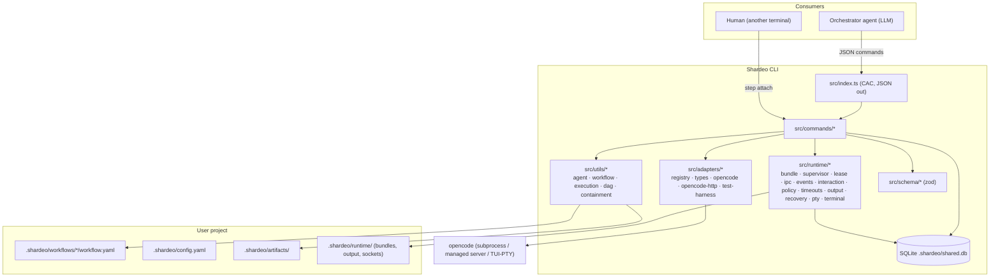
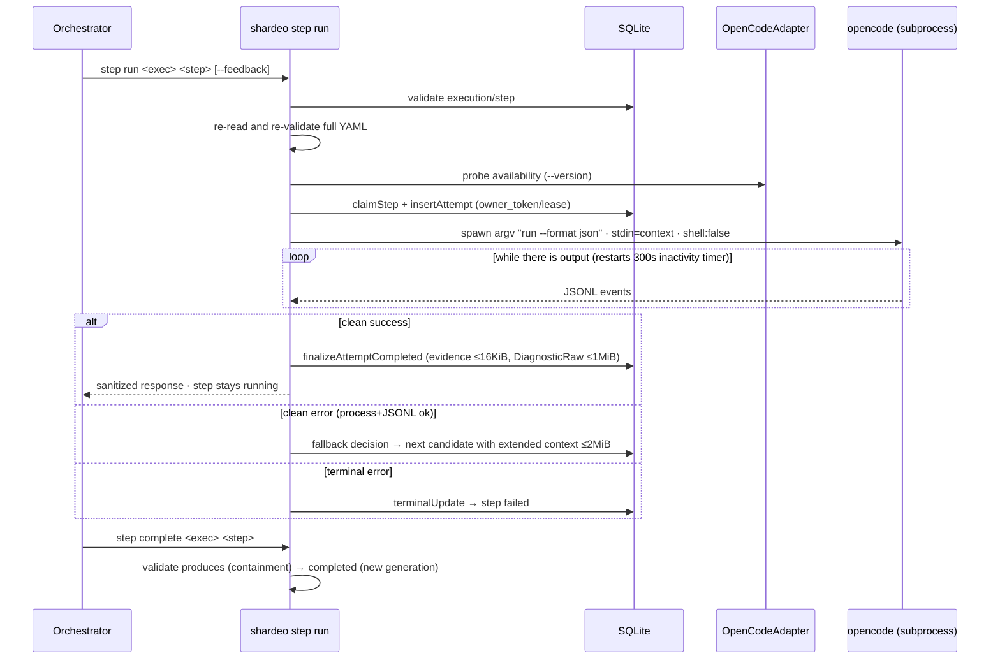
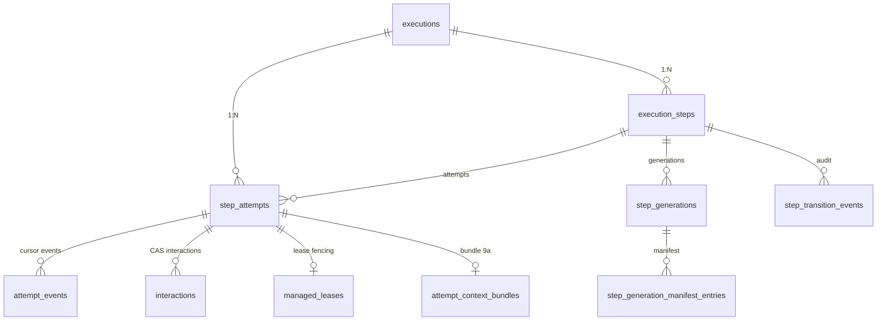

# Project Context — Shardeo

> Technical reference document generated from repository evidence (commit `0c813f7`, branch `main`, August 2026). Its purpose is to serve as a comprehensive source of context for developers and LLM agents working on this project, minimizing additional exploration.
>
> Convention used throughout the document: **(Fact)** = verified in the repository · **(Inference)** = deduction from the analysis · **(Recommendation)** = suggestion not backed by an explicit pending item.

---

## 1. Executive summary

**Shardeo** (v0.1.0, MIT license) is a CLI tool written in TypeScript that structures and manages the execution of AI-assisted software development workflows (Fact: `package.json`, `README.md`, `AGENTS.md`).

It is not an agent or an IDE: it does not replace OpenCode, Codex CLI, Claude Code or similar tools. It gives them structure: it defines what to execute, with what context, in what order and with what runtime. An **orchestrator agent** (an LLM in a CLI such as OpenCode) consumes Shardeo's commands to advance through a workflow step by step; Shardeo validates the workflow, prepares and injects context, invokes the agent runtime, applies policies and persists all execution evidence in SQLite (Fact: `AGENTS.md`, `SPECS.md`).

- **Target users**: engineers and teams that use coding agents and want reproducible processes, consistent context and full traceability (Fact: `AGENTS.md` §Value proposition).
- **Current state**: functional MVP with functional specifications 1–9 implemented and delivered on `main`; Spec 10 in draft; initiative 008 (incorporating Codex as a second harness) is blocked awaiting human review (Fact: `SPECS.md`, `.docs/initiatives/008-*/01-*/status.json`). Test suite: 550 cases, all green in verified execution; `tsc --noEmit` clean (Fact: own verification of this analysis).
- **Size**: 50 TypeScript files in `src/` (~16.3k LOC), 87 files in `test/` (~74 suites referenced in the `test` script) (Fact).

## 2. Objective and scope

### Problem it solves
Coding agents lack structure: every invocation starts from scratch, context is passed manually, there is no record of what was executed or with what result, and team conventions do not translate into reproducible processes (Fact: `AGENTS.md` §The problem it solves).

Shardeo separates three responsibilities: **methodology** (what to do: workflows), **knowledge** (with what context: skills/artifacts) and **execution** (who does it: interchangeable runtimes via adapters) (Fact: `AGENTS.md`).

### Main features (implemented)
1. Project initialization (`shardeo init`) and `.shardeo/` structure.
2. Workflow discovery (`workflows list/describe`) with Zod validation.
3. Workflow execution as a DAG driven by `depends_on` (`run`, `steps next`, `step run`, `step complete`).
4. `command` steps (deterministic, self-completed) and `agent` steps (via external runtime, today only OpenCode).
5. Step re-execution with feedback (`--feedback`), fallback between candidates and bounded accumulated context.
6. Full persistence in SQLite + reconciliation/resumption (`resume`, `status`).
7. Orchestrator-driven iteration control (`step reopen --cascade`, `step skip`) with artifact generations and audit.
8. Three execution surfaces for agent steps (Spec 9): `headless`, `supervised` (local supervisor, mediated permissions, events with cursor, `step approve`) and `terminal` (attachable PTY with human handoff, `step attach`).
9. Reproducible per-attempt context through immutable *bundles* with neutral manifest (order, limits, SHA-256).
10. Adapter-native detection of permission requests (versioned OpenCode 1.17.18 fixtures + HTTP/SSE bridge against the managed OpenCode 1.18.x server).

### Out of scope / not implemented
- **Semantic interpretation** of agent responses or workflow decisions: that belongs to the orchestrator (Fact: `SPECS.md` §Orchestration principle).
- **Second harness (Codex)**: initiative 008 blocked (Spec 01 headless) and its Spec 02 (app-server supervised) not started (Fact: `.docs/initiatives/008-*`).
- **Spec 10** (semantic model/provider override in `step run`): only a draft in `SPECS.md`, no code (Fact: `SPECS.md` lines 1326+; no `--harness/--provider/--model/--variant` flags in `src/index.ts`).
- **Roadmap v2** described but not implemented: explicit CLI registration in config, `shardeo doctor`, `shardeo setup` (Fact: `AGENTS.md` §Future: v2).
- Real parallelism: Shardeo reports which steps are executable; it never executes in parallel by itself (Fact: `SPECS.md` Spec 5).

## 3. Current development state

### Implemented (verified in code + tests + git)
| Area | Evidence |
|---|---|
| Init and structure | `src/commands/init.ts`, `test/test-init.mjs` |
| Workflow discovery and validation | `src/utils/workflow.ts`, `src/schema/workflow.ts`, `test/test-workflows.mjs`, `test/workflow-schema.test.mjs` |
| `depends_on` DAG (Spec 5) | `src/utils/dag.ts`, `test/utils/dag-execution.test.mjs` |
| Command steps (Spec 3) | `src/utils/execution.ts`, `test/e2e/spec3-e2e.test.mjs` |
| Headless agent steps + fallback (Spec 4) | `src/utils/agent.ts`, `src/commands/steps.ts`, `test/agent-contract/lifecycle/fallback/snapshot.test.mjs` |
| Re-execution with feedback (Spec 6) | `migrateSpec6` migration, `test/re-execution.test.mjs` |
| Persistence and resume (Spec 7) | `src/db/queries.ts`, `src/commands/resume.ts`, `test/execution-persistence.test.mjs`, `test/spec7-retry-regressions.test.mjs` |
| Reopen/skip iteration with generations (Spec 8) | `migrateSpec8`, `test/spec8-iteration-control.test.mjs`, `test/e2e/spec8-e2e.test.mjs`, commit `3f8918a` |
| Headless/supervised/terminal surfaces (Spec 9a/9b/9c) | Full `src/runtime/*`, `src/adapters/*`, tests `spec9a-*`, `supervised-*`, `terminal-*`; commits `e11954f`…`aeccd82` |
| Native permission detection + managed server bridge (initiative 007) | `src/adapters/opencode.ts` + `src/adapters/opencode-http.ts`, commits `148306e`…`0c813f7`; both specs delivered to `main` ff-only according to their `status.json` |

### Partially implemented
- **Spec 4** is marked `implemented` (not `done`): it remains the authority only for the `headless` path; live permission resolution lives in Spec 9 (Fact: `SPECS.md`).
- **Headless permission detection** limited to exact OpenCode 1.17.18 fixtures; the live path requires `supervised` mode (Fact: `SPECS.md` Spec 4 §5, `test/fixtures/opencode/v1.17.18/`).

### Pending
- **Initiative 008 Spec 01** ("Builtin Codex for headless execution"): `stage: blocked`, `completed: false` (Fact: `status.json`). Prior session context: three implementation attempts failed validation on public boundary regression coverage (findings F-02..F-08); the user chose human review (recorded in Engram, sessions 2026-08-19/20). *(Inference supported by session memory, not by repository files.)*
- **Spec 10**: complete draft in `SPECS.md` with acceptance criteria, no implementation (Fact).
- **v2**: `doctor`, `setup`, CLI registration (Fact: `AGENTS.md`, marked "Future").

### Deprecated or apparently unused
- **`shardeo.py`** (594 lines, repo root): original Python POC that invoked `claude-code` and used a different DB (`shardeo.db`). It is not referenced by `package.json` or the TS code. It is tracked in git. *(Inference: legacy of the initial prototype; keep only for historical value.)*
- **`AGENTS.old.md`**: previous version of the agent instructions, kept alongside the current `AGENTS.md` (Fact).
- **`.shardeo/workflows/simple-feature/`**: internal dogfooding workflow that declares `claude-code` agents, which is **invalid** under the current v1 schema (only `opencode`, Fact: `src/schema/workflow.ts`). It is not tracked by git. *(Inference: leftover from the pre-TypeScript era; it would break validation if executed.)*
- Scattered dead code: in `cmdStepRun` (`src/commands/steps.ts` ~lines 232–245) there are `workflowMode`/`workflowModeInferred` variables computed and immediately discarded with `void` — remnants of Spec 9a development (Fact).

## 4. Technology stack

| Technology | Version | Role |
|---|---|---|
| TypeScript | ^5.3.3 (`strict: true`, target ES2022, module Node16, ESM) | Whole product compiled to `dist/` |
| Node.js | >=20 (engines); verified with v22.23.1 | Runtime |
| CAC | ^6.7.14 | CLI framework (command definitions in `src/index.ts`) |
| better-sqlite3 | ^12.11.1 | Synchronous embedded persistence, WAL, `.shardeo/shared.db` |
| zod | ^3.23.0 | Runtime validation of workflows, config and internal schemas (`src/schema/*`) |
| yaml | ^2.3.4 | Parsing of `workflow.yaml` / `config.yaml` |
| node-pty | ^1.1.0 | Real PTY for the `terminal` mode — the only allowed import in `src/runtime/pty.ts` (Fact: module docstring) |

**Dev/tooling**: `typescript`, `@types/node` ^20, `@types/better-sqlite3`. Test runner: native `node:test` (no Jest/Vitest). There is no ESLint, Prettier, EditorConfig or Husky configured (Fact: verified absence at root), although there are code comments mentioning eslint.

**Infrastructure/external services**: none required. The OpenCode integration is local (subprocess and/or local managed HTTP server with ephemeral Basic auth; secrets redacted in `src/adapters/opencode-http.ts`). No cloud, no queues, no own remote APIs (Fact).

**npm scripts** (Fact: `package.json`):
- `build` → `tsc` · `typecheck` → `tsc --noEmit`
- `pretest` → build · `test` → `node --test <explicit list of 74 .test.mjs files>`
- `test:terminal-fix-round` → terminal subset · `prepublishOnly` → build

## 5. Architecture

### General model

Shardeo is a **deterministic workflow runtime** with an integration boundary (adapter) that isolates the core from any agent provider:

1. **CLI layer** (`src/index.ts`): single command boundary, centralized EPIPE/error policy, extra-argument validation, structured JSON output by default.
2. **Commands layer** (`src/commands/*`): orchestrates each command; contains no deep business logic.
3. **Core** split into:
   - `src/utils/*`: workflow loading/validation, headless agent engine, artifact validation, DAG, path containment.
   - `src/runtime/*`: Spec 9 components — immutable bundle, admission, transport, supervisor, lease with fencing, UDS IPC, events with cursors, interaction broker (CAS), permission policies, independent timeouts, output store, recovery/orphaned, PTY and human attach.
   - `src/adapters/*`: provider-neutral contract (`types.ts`), registry, OpenCode adapter (probe + headless + supervised HTTP/SSE + terminal) and test adapters.
   - `src/schema/*`: Zod schemas (workflow, config, mode, adapter, bundle, supervised).
4. **Persistence**: SQLite (WAL) in `.shardeo/shared.db`; transactional state machine in `src/db/queries.ts`; idempotent per-spec migrations in `src/db/connection.ts`.
5. **Harness runtime**: the `opencode` binary (headless subprocess, managed server for supervised, TUI in PTY for terminal).

Governing principle: **the core never knows a provider's endpoints, flags, fixtures or event names**; everything provider-specific lives behind the adapter (Fact: `SPECS.md` Spec 9, docstrings of `src/adapters/types.ts`).



### Dependencies between modules (observable rules)
- `commands → utils/runtime/db/adapters`; the utils are mostly pure or bounded I/O; `runtime` is the only one touching node-pty, UDS sockets and decoupled processes.
- `adapters` depends on `schema` and `runtime/pty` (types), never the other way around: the core does not import provider literals (Fact: `registry.ts`, `types.ts`).
- Live signaling goes through **local UDS IPC**, never SQLite; SQLite is state/audit (Fact: `SPECS.md` §Coordination).

## 6. Repository structure

```text
shardeo/
├── src/
│   ├── index.ts              # CLI entry (CAC), EPIPE/error policy, adapter registration
│   ├── commands/             # init · workflows · run · steps · status · resume · supervised · attach
│   ├── utils/                # agent.ts (headless engine, 2059 LOC) · workflow.ts (safe validation)
│   │                         # execution.ts (requires/produces) · containment.ts · dag.ts · mode.ts
│   │                         # errors.ts (terminal codes) · canonical-json.ts
│   ├── runtime/              # bundle · admission · transport · retention · pty · terminal · attach
│   │                         # supervisor(-process/-entry) · lease · ipc · events · interaction
│   │                         # policy · timeouts · output · recovery · socket-path
│   ├── adapters/             # types.ts (neutral contract) · registry.ts · opencode.ts (943 LOC)
│   │                         # opencode-http.ts (SSE/HTTP bridge) · test-harness.ts
│   ├── schema/               # workflow · config · mode · adapter · bundle · supervised (zod)
│   └── db/                   # connection.ts (schema+migrations) · queries.ts (state machine, 2365 LOC)
├── test/                     # 87 node:test files (+opencode v1.17.18 and v1.18.16 fixtures)
├── tools/scripts/initiative/ # Meta-workflow harness used to develop Shardeo with agents
├── dist/                     # tsc output (gitignored)
├── .docs/initiatives/        # Technical specs and initiative execution history (gitignored)
├── .docs/spikes/             # Spikes: Traycer analysis, initiative pipeline migration
├── .atl/                     # Skill registry generated by external tooling (gitignored)
├── .shardeo/                 # Own dogfooding instance (gitignored): config, 1 legacy workflow, artifacts
├── AGENTS.md / AGENTS.old.md # Current operating instructions / legacy
├── SPECS.md                  # AUTHORITATIVE FUNCTIONAL CONTRACT (Specs 1–10)
├── README.md                 # Quick start and key contracts
├── shardeo.py                # Original Python POC (legacy)
├── package.json / tsconfig.json / package-lock.json
```

Notes: `.gitignore` uses the `.*/` pattern → **all** dot directories (`.docs/`, `.atl/`, `.shardeo/`) are ignored; only `src/`, `test/`, `tools/`, root docs and configs are versioned (Fact: `git ls-files`). There is no CI, Docker or lint configs (Fact).

## 7. Main components and modules

### 7.1 CLI entry — `src/index.ts`
- **Responsibility**: register CAC commands, validate arity/flags, emit structured JSON errors `{error, code?, ...}` with `exitCode 1` (`ExitCode` in `src/utils/errors.ts`; only 0/1 exist).
- **Commands**: `init`, `workflows list|describe [--human]`, `run <wf>`, `steps next <exec>`, `step run|complete|reopen|skip|events|status|output|approve|attach`, `status <exec>`, `resume <exec>`.
- **Considerations**: explicit EPIPE handling on stdout (exit 0 if the consumer closed the pipe); rejection of extra positional arguments respecting `--`. On load, it calls `registerBuiltinAdapters()`.

### 7.2 Headless agent engine — `src/utils/agent.ts` (~2059 LOC)
- **Responsibility**: Spec 4 lifecycle: *probe → claim(lease) → invoke(heartbeat) → finalize*. Restricted fallback without semantic classification.
- **Key points**:
  - Hard budgets: snapshots 1 MiB/step; `DiagnosticRaw` 1 MiB (single raw-bytes authority; above that keeps prefix+suffix+size+SHA-256); cumulative fallback context 2 MiB; visible projections/evidence 16 KiB (Fact: constants lines 31–39).
  - Sanitization with credential redaction by patterns (`scanCredentialAssignments`, `sanitizeAgentOutput`, `projectProviderError`).
  - JSONL parser of the OpenCode stream (provider coupling **deliberate but confined here until initiative 008**, which must move it to the adapter).
  - Default inactivity timeout 300 s restarted by output; lease owner_token + 10 s heartbeat.
- **Terminal errors** (no fallback): `permission_required`, `permission_detection_unsupported`, `permission_timeout`, `process_inactivity_timeout`, `interaction_timeout`, `artifact_context_too_large`, `adapter_contract_error`, `process_start_failed`, `process_cleanup_failed`, `context_error`, `persistence_error` (Fact: `TERMINAL_COMPLETION_REASONS` in `src/utils/errors.ts`).

### 7.3 Workflow loading and validation — `src/utils/workflow.ts` + `src/schema/workflow.ts`
- **Responsibility**: read `.shardeo/workflows/<name>/workflow.yaml`, validate with Zod and business rules (single entry without `depends_on`, no cycles, valid references, `VALID_AGENT_IDENTIFIERS = {"opencode"}` whitelist).
- **Security**: name validated by grammar before I/O; path containment resolved as defense in depth; symlink rejection at every level; ANSI/OSC sanitization in human output; YAML limits 512 KB / instructions 256 KB; only ENOENT is "does not exist", other FS errors are structured. The canonical name is the directory name, not the `name` field of the YAML (Fact: docstring).

### 7.4 Artifacts and containment — `src/utils/execution.ts` + `src/utils/containment.ts`
- `requires`/`produces` are resolved under `.shardeo/artifacts/` (not cwd). `validateContainedPath` rejects absolutes, `..` and symlink escapes; internal symlinks allowed if their real target stays inside.

### 7.5 Adapters — `src/adapters/*`
- `types.ts`: contracts `HarnessAdapter`, `HarnessAdapterSupervised`, `HarnessAdapter9c` (terminal), permission detectors, bundle/session handles, admission receipts. **Zero provider literals.**
- `registry.ts`: registration by identifier (strict regex), factories for fresh instances per child process; only built-ins in production.
- `opencode.ts` (only builtin): probe via `opencode --version` (spawnSync 3 s) → `HarnessCapabilityManifest` (supported headless/supervised/terminal modes; supervised with `permission` interaction, `request` scope). Headless launches direct argv `run --format json [--model]` with context stdin, `shell:false`. Supervised uses a local managed server with its own HTTP client (`opencode-http.ts`: SSE, frame limits 64–256 KiB, redaction of secrets/Basic/auth headers, server-ready timeout 20 s). Terminal declares PTY capabilities (`requires_real_pty`, attach via UDS relay).
- `test-harness.ts`: neutral adapters for capability/neutrality/launch tests.

### 7.6 Spec 9 runtime — `src/runtime/*`
| Module | Responsibility |
|---|---|
| `bundle.ts` | Materializes/per-attempt copies, freezes manifest (Spec 4 semantic order, roles, eager/on_demand, bytes+SHA-256), verifies integrity |
| `admission.ts` | Validates receipt against frozen bundle (bundle_id, manifest_sha256, mandatory digests); closed failure on drift |
| `transport.ts` | Pure selection of announced transport (`direct_injection`, `file_reference`, …) by mode/limits |
| `supervisor.ts` (+ `-process/-entry`) | Owner supervisor cycle: decoupled spawn, readiness handshake, event loop, output sink, timeouts; `startSupervisedAttempt` orchestrates lease+bundle+transport+IPC |
| `lease.ts` | Lease with fencing (monotonic generation, PID guard; a reused PID does not authorize killing processes) |
| `ipc.ts` | Local UDS, 64 KiB framing, 5 s ack, request_id dedup, generation binding |
| `events.ts` | Event store with monotonic cursor persisted before visible; anti-duplicate uniqueness on retry |
| `interaction.ts` | CAS broker pending→resolving→resolved/resolution_failed; idempotent; identity crossing rejected; crash while resolving → orphaned unless resume proven |
| `policy.ts` | Provider-neutral evaluation (`prompt` default, `deny`, `rules` by exact capability); deny precedes; automatic decision only if in `available_decisions`; actor `"policy"` audited |
| `timeouts.ts` | Three independent timers with injectable clock: process inactivity (3 modes), interaction decision (supervised), human presence (terminal); default 300 s |
| `output.ts` | Incremental sanitized buffer on disk per attempt; `--tail` always; `--full` only terminal; bounded retention; no internal path leakage |
| `recovery.ts` | Detection of expired leases/missing supervisors; resume conditional on adapter announcement; cleanup only of resources whose ownership can be proven |
| `retention.ts` | Cleanup of old or over-budget bundles/output, protecting assets and recoverable orphans |
| `pty.ts` / `terminal.ts` / `attach.ts` | Real PTY (node-pty), terminal state machine, raw human↔PTY relay without SQLite |

### 7.7 Persistence — `src/db/connection.ts` + `src/db/queries.ts`
- `connection.ts`: singleton, WAL, busy_timeout 5 s, POSIX permissions 0600/0700, `ensureTables` + idempotent transactional migrations with SQLITE_BUSY retry (50/100/200 ms): `migrateSpec4/6/7/8/9a/9b/9c`.
- `queries.ts`: complete state machine — atomic step claim, attempt insertion (incl. reconstruction and feedback), heartbeat, success/failure/fallback finalization, reconciliation of expired attempts, atomic reopen/skip with generations and audit, snapshot totals, status summary (`getExecutionStatusSummary`). All receive `Database` for test injection.

## 8. Main flows

### 8.1 Basic workflow cycle (Specs 1–3)
```
shardeo init → shardeo run <wf> (validates graph, creates exec + pending steps) 
  → steps next <exec> (steps with satisfied depends_on) 
  → step run <exec> <step> 
      · command: executes, validates produces → automatic completed
      · agent: see flow 8.2
  → step complete <exec> <step> (agent: validates produces under .shardeo/artifacts/)
  → status / resume as needed
```

### 8.2 Agent step in `headless` mode (Spec 4; blocking)

Injected context in fixed order: operational instructions → domain instructions → skills → required artifacts → prior attempt artifacts/context → delimited feedback.

### 8.3 Mediated permission in `supervised` (Spec 9b)
```mermaid
sequenceDiagram
    participant O as Orchestrator
    participant C as shardeo CLI
    participant S as Supervisor (bg, lease+fencing)
    participant A as Adapter
    participant H as OpenCode managed server
    O->>C: step run ... --mode supervised
    C->>A: probe capabilities (real runtime)
    C->>S: start supervisor (lease + UDS IPC)
    S->>S: materialize and freeze bundle (SHA-256 manifest)
    A->>H: admit mandatory inputs (announced transport, digests)
    S->>H: open session → readiness handshake
    C-->>O: attempt_started {attempt_id, cursor, bundle_id, transport}
    H-->>A: native permission request (HTTP/SSE)
    A->>S: normalize → interaction_required + available_decisions
    S->>DB: persist event; state awaiting_interaction
    O->>C: step events --after <cursor>
    C-->>O: interaction_required event
    O->>C: step approve --interaction-id X --decision allow_once|deny
    C->>S: IPC (CAS pending→resolving→resolved, idempotent)
    S->>A: translateDecision → native protocol
    A->>H: apply decision
    S-->>O: interaction_resolved → running → attempt_completed
```

### 8.4 Human handoff in `terminal` (Spec 9c)
1. `step run --mode terminal` creates attempt + supervisor + attachable PTY; freezes and admits bundle before activating the harness.
2. Returns `awaiting_human` and the exact command `shardeo step attach <exec> <step> --attempt-id <id>`.
3. The person runs attach from another terminal (raw UDS relay); detach does **not** kill the child; unlimited reattach while `human_presence_seconds` does not expire without presence.
4. When the harness closes, supervisor persists the result and publishes the terminal event. The orchestrator never writes keys or interprets the screen.

### 8.5 Reconciliation and resume (Spec 7 + Spec 9b recovery)
`shardeo resume` reconciles expired attempts (`reconcileExpiredAttemptsForExecution`), marks reconstruction required if a completed artifact is missing on disk (delivering the agent's previous response as context), syncs `executions.status` and returns continuation guidance.

### 8.6 Directed iteration (Spec 8)
`step reopen --cascade --feedback` reopens a completed/failed step, invalidates its valid generation (files remain for audit but no longer satisfy `requires`/`complete`) and restarts descendants preserving history; `step skip --reason` marks pending-without-attempts as `skipped` (terminal for `depends_on`, but generates no artifacts). Everything lands in `step_transition_events`.

## 9. Data model

SQLite in `.shardeo/shared.db` (WAL). Base schema + cumulative idempotent migrations per spec (Fact: `src/db/connection.ts`).

**Core tables**
- `executions(id PK, workflow, status, created_at, updated_at)` — aggregate states synced with step transitions.
- `execution_steps(id PK, FK executions, step_id, status, created_at, started_at*, completed_at, reconstruction_required*, missing_artifacts_json*, current_generation*, valid_generation*; UNIQUE(execution_id, step_id))` — status ∈ pending/running/completed/failed/skipped (*Spec 7/8 columns).
- `step_attempts(id PK, FK executions, step_id, attempt_number, agent_used, model, exit_code, stdout, stderr, created_at, completed_at, owner_token*, lease_expires_at*, evidence_json*, evidence_digest*, evidence_version*, decision*, completion_reason*, snapshot_json*, duration_ms**, feedback_text**, step_generation***, reopen_event_id***, bundle_id⁹ᵃ, manifest_sha256⁹ᵃ, bundle_transport⁹ᵃ, native_identity⁹ᶜ; UNIQUE(execution_id, step_id, attempt_number))` — decision ∈ success/fallback/terminal.

**Auxiliary tables**
- Spec 8: `step_transition_events` (reopen/skip/generations audit), `step_generations`, `step_generation_manifest_entries`, `step_generation_invalidations`, `reopen_feedback_consumptions`.
- Spec 9a: `spec9a_bundles`, `attempt_context_bundles`.
- Spec 9b: `managed_leases`, `attempt_events` (cursors), `interactions` (CAS), `output_meta`.


*(Hard FKs verified only towards `executions`; the other relationships are logical by execution_id/step_id/attempt_id — Inference from columns and queries.)*

Important rules: an artifact's validity belongs to the step's **generation** (Spec 8), not to the bytes; attempts are append-only; `evidence_version`/digest protect evidence integrity; shared canonical JSON (`canonical-json.ts`, keys ordered by UTF-8 bytes).

## 10. API and interfaces

There is no product-owned HTTP API: the interface is the **CLI with one-line JSON output per stdout** (`--human` option only in `workflows`). The HTTP/SSE bridge of `opencode-http.ts` is internal towards the managed OpenCode server (localhost, ephemeral Basic auth redacted in logs).

Essential commands and contracts (Fact: `src/index.ts`, `SPECS.md`):

| Command | Key flags | Output / behavior |
|---|---|---|
| `init` | — | Creates `.shardeo/` idempotently |
| `workflows list` | `--human` | JSON `{name, description}` or marked invalid with Zod error |
| `workflows describe <wf>` | `--human` | Detail: instructions + steps (id, type, agents, depends_on, requires, produces) |
| `run <wf>` | — | Validates graph; returns execution-id |
| `steps next <exec>` | — | Available steps with id/type/agents (parallelizable at orchestrator's discretion) |
| `step run <exec> <step>` | `--feedback`, `--mode headless\|supervised\|terminal` | headless: blocks and returns sanitized result; supervised/terminal: returns `attempt_started` with attempt_id/cursor/bundle/attach_command |
| `step complete` | — | Validates `produces`; fails if missing; step remains in progress |
| `step reopen` | `--cascade`, `--feedback` | Fails if it would affect descendants without `--cascade` |
| `step skip` | `--reason` | Only pending steps without started attempts |
| `step events` | `--attempt-id`, `--after` (exclusive), `--limit` | Stable pagination by cursor; source of semantic transitions |
| `step status` | `--attempt-id` | Current view (may omit intermediate transitions) |
| `step output` | `--tail N`, `--full` (terminal only) | Only path for high-volume output; does not advance cursor |
| `step approve` | `--interaction-id`, `--decision` | Only decisions announced in `available_decisions`; rejects identity crossings |
| `step attach` | `--attempt-id` | Human↔PTY relay; fails if candidate ambiguity |
| `status <exec>` / `resume <exec>` | — | Durable summary / reconciliation + guidance |

Errors: JSON `{error, code?}` + exit 1. Relevant codes: `invalid_mode`, `invalid_feedback`, `invalid_option`, `unsupported_capability`, `unsupported_policy_decision`, `interaction_already_resolved`, `adapter_probe_failed`, `adapter_contract_error`, terminal codes listed in §7.2.

## 11. Authentication, authorization and security

There is no user authentication or multi-tenancy: Shardeo operates locally on the current project. The security model is one of **containment and minimization** (Fact):

- **Agent permissions**: hierarchical policy `step.permission_policy > workflow > config defaults` with modes `prompt` (default) / `deny` / `rules` by exact normalized capability (`filesystem.read/write`, `process.execute`, `network.request`, `unknown`). An automatic authorization can only choose decisions present in the adapter's `available_decisions`; `deny` precedes; unknown capabilities fall to the safe default; every automatic resolution is audited with `actor: "policy"`.
- **No-bypass**: `--auto`/`--dangerously-skip-permissions` are never injected; invocation with `shell:false`, direct argv, no interpolation.
- **Path containment**: rejection of absolutes, `..` and symlink escapes in workflows, instructions, skills, artifacts and bundles (`validateContainedPath`, containment reinforced by realpath in Spec 9a).
- **Bounded evidence**: projections 16 KiB; `DiagnosticRaw` ≤1 MiB as the only raw authority (with SHA-256 if exceeded); snapshots ≤1 MiB; fallback context ≤2 MiB — all sanitized and redacted (credentials by key/value patterns, Basic auth, bearer, tokens).
- **Supervised HTTP bridge**: ephemeral secrets generated per attempt; `redactCredentials` guarantees the secret and its Basic derivative never appear fragmented in projected errors (`projectHttpFailure`).
- **FS**: `.shardeo/shared.db` and runtime with POSIX permissions 0600/0700.
- **Headless permission detection**: only exact versioned OpenCode 1.17.18 fixtures → `permission_required`; ambiguous or unknown evidence fails closed (`unsupported-ambiguous`) — never guessed.

## 12. Configuration and environment variables

**Environment variables**: none required by Shardeo. The only observable use is the process `PATH` to probe executables (`probeCapabilities` optionally accepts a `path_env` for the child). There are no `.env` files or reading of configuration env vars in `src/` (Fact). *(Inference: environments with CLIs installed via nvm/pyenv can fail PATH resolution — precisely the motivation for the CLI registration planned for v2.)*

**`.shardeo/config.yaml`** (permissive Zod schema `.passthrough()`, Fact: `src/schema/config.ts`):
| Field | Purpose | Default |
|---|---|---|
| `agent.inactivity_timeout_ms` | Agent process inactivity timeout | 300000 (5 min) |
| `defaults.agent_mode` | Default surface for agent steps | `headless` |
| `defaults.permission_policy` | Global permission policy | `prompt` |

Mode resolution: `step.mode > workflow.mode > config defaults.agent_mode` (+ `--mode` override only for that attempt). `command` steps do not use mode.

## 13. External integrations

| Service | Use | Where | How it works |
|---|---|---|---|
| **OpenCode CLI** (v1.17.18 fixtures; live tested against 1.18.x) | Execution runtime of agent steps (only v1 supported) | `src/adapters/opencode.ts`, `opencode-http.ts`, `test/fixtures/opencode/*` | Headless: `run --format json` subprocess with parsed JSONL. Supervised: local managed server + HTTP/SSE with native interaction bindings. Terminal: TUI inside a real PTY. Probe: `opencode --version` (accepts plain semver). |
| **Claude Code** | Only in the legacy Python POC | `shardeo.py` | `claude -p {prompt}` invocation. No relation to the TypeScript product. |
| **Traycer** | Conceptual inspiration only | `.docs/spikes/01_traycer-analysis.md`, `SPECS.md` §Relation to Traycer | No code dependency. |

Required configuration: have `opencode` resolvable in PATH. Nothing else (no remote APIs, no cloud).

## 14. Running the project

Commands backed by the repository (Fact: `package.json`, `README.md`):

```bash
# Install dependencies
npm install            # or pnpm install

# Verify types / compile
npm run typecheck      # tsc --noEmit
npm run build          # tsc → dist/

# Tests (pretest compiles first)
npm test               # node --test <74 suites>; ~46 s observed
npm run test:terminal-fix-round   # terminal subset

# Planned global installation for end users
pnpm add -g shardeo    # bin: shardeo → dist/index.js

# Usage in a project
shardeo init
shardeo workflows list
shardeo run <workflow>
shardeo steps next <execution-id>
shardeo step run <execution-id> <step-id>
```

Production: distribution as an npm package (`files: ["dist"]`, `prepublishOnly: build`, engines >=20). There is no server deployment procedure: it is a local tool (Fact).

## 15. Testing and quality

- **Runner**: native `node:test`; explicit list of 74 suites in `npm test`; 87 files in `test/` (the extras are helpers/fixtures). Own execution evidence: **550 tests, 130 suites, all passing (~47 s)**; a first run produced 1 unidentified intermittent failure → there is at least one timing-sensitive test *(Inference: probably in timers/supervised/terminal suites)*.
- **Types**: unit tests (schemas, DAG, containment, sanitizer), DB state machine, agent lifecycle with deterministic JSONL fixtures, supervisor/IPC/lease/events integration, real e2e (`spec3-e2e`, `spec8-e2e`, `supervised-e2e`, `permission-detection-e2e`, real PTY in `terminal-real-*`).
- **Fixtures**: `test/fixtures/opencode/v1.17.18/*.jsonl` (success, tool-use, permission-ask/refusal/tool-reject/auto-reject stderr, provider error, malformed) and `v1.18.16/http-api-server.mjs` (simulated HTTP server), `fixtures/permission-auto-resolve.mjs`.
- **Coverage**: no tool configured → *Not determined*.
- **Lint/format**: not configured; quality relies on `tsc --strict` + human review + initiative flow with validators (Fact/Absence).

## 16. Deployment and infrastructure

- **Environments**: local only (CLI). No Docker, no CI/CD, no infrastructure manifests (Fact: verified absence).
- **Distribution**: npm registry (metadata ready in `package.json`: bin, files, prepublishOnly, MIT license, keywords).
- *(Inference: the development pipeline uses the initiative meta-workflow in `.docs/initiatives/` with per-attempt worktrees under `~/.worktrees/shardeo/`; deliverables are integrated to `main` ff-only according to the status.json files of specs 007.)*

## 17. Key technical decisions

1. **External orchestration**: Shardeo executes and persists requested transitions; it never interprets responses or decides paths. Every orchestrator decision goes through an explicit, validated and auditable command (`SPECS.md` §Orchestration principle).
2. **One property per workflow field**: `depends_on` = order (single DAG input); `requires`/`produces` = validation, never precedence.
3. **Fallback without semantic classification**: after a clean invocation (process started/cleaned + valid JSONL), *any* clean error advances to the next candidate. Inferring quota/context/model is forbidden. Terminal errors enumerated in `src/utils/errors.ts`.
4. **Provider-neutral adapter boundary** (Spec 9): the core contains no provider endpoints, flags, fixtures or event names. Today there is one conscious exception: the OpenCode JSONL parser lives in `src/utils/agent.ts` (Spec 4 headless path); initiative 008 exists precisely to move that interpretation to the adapter (Fact: 008 `spec.md`).
5. **Reproducible context**: immutable bundle per managed attempt with neutral manifest (Spec 4 semantic order, stable roles, `eager`/`on_demand`, bytes+SHA-256); admission proof mandatory before provider work; drift → closed failure.
6. **Single ownership and fail-closed**: lease with generational fencing; idempotent CAS resolution; on unreconcilable crash → `orphaned` with preserved evidence and human recovery; never re-authorize blindly.
7. **Channel separation**: live signaling via UDS IPC; SQLite for state/audit; full output only via sanitized `step output`.
8. **Evidence as contract**: projections 16 KiB / DiagnosticRaw ≤1 MiB / snapshots 1 MiB / fallback 2 MiB; shared canonical JSON; `evidence_version`+digest.
9. **Cumulative idempotent migrations**: each spec adds its transactional migration with SQLITE_BUSY retry; backward compatibility required by tests (`test/db/*.test.mjs`, including `step_attempts` table reconstruction in 9c).
10. **TDD and vertical spec development**: the repo itself is developed with an initiative pipeline (`.docs/initiatives/`) with design → implementation → validation → ff-only integration to `main`.

## 18. Technical debt, risks and detected issues

**Observed facts**
- **Stale states in `SPECS.md`**: Specs 5, 6 and 8 are marked `status: pending` but are implemented (code + tests + commits `3f8918a`, `ed6000d`; AGENTS.md declares them delivered). Doc/code contradiction: **the code represents the real behavior**; the status markers fell behind *(Inference on cause)*.
- **Dead code** in `cmdStepRun` (`src/commands/steps.ts` ~232–245): `workflowMode`/`workflowModeInferred` computations discarded with `void`; additionally, workflow mode is re-read by re-parsing the YAML apart from the validated load (double read).
- **`shardeo.py`** tracked legacy POC, invokes `claude-code`, different DB schema (`shardeo.db` vs `shared.db`).
- **Invalid dogfooding workflow**: `.shardeo/workflows/simple-feature/workflow.yaml` declares `claude-code` (rejected by the v1 schema).
- **No ESLint/Prettier/CI**: code comments mention eslint but there is no configuration or pipelines.
- **Potentially flaky test**: 1 intermittent failure observed in one of two complete runs.
- **`.gitignore` with `.*/`**: `.docs/` (authoritative specs and decision history), `.atl/` and `.shardeo/` are not versioned → risk of losing process context if there is no backup *(the risk is an inference; the fact is that they are not versioned)*.
- **Residual worktrees**: 4 worktrees of blocked spec 008 attempts all point to the base commit `0c813f7` (cleanup pending per the initiative flow).
- `AGENTS.old.md` duplicates outdated instructions alongside the current ones.

**Technical risks** *(Inferences)*
- OpenCode JSONL coupling in `src/utils/agent.ts`: any stream change affects the headless path until 008 is executed.
- Headless permission detection tied to exact 1.17.18 fixtures: fragility against OpenCode updates without moving to supervised mode.
- Absence of lint/CI: style/pattern regressions depend on human review.

**Recommendations** (not backed by an explicit pending item)
- Update `status:` markers of Specs 5/6/8 in `SPECS.md`.
- Remove dead code from `cmdStepRun` and unify workflow mode reading.
- Decide the fate of `shardeo.py`, `AGENTS.old.md` and the invalid dogfooding workflow.
- Introduce ESLint (with typescript rules) + minimal CI (typecheck+tests) before the team grows.
- Version `.docs/` or establish an explicit backup.

## 19. Pending items and next steps

**Explicit ones found in the repo**
1. **Unblock Spec 008/01 — Builtin Codex headless** (`.docs/initiatives/008-codex-multi-harness-foundation/01-codex-headless-builtin/spec.md`, status `blocked`). Requires closing the human review of findings F-02..F-08 (public results boundary) and, per decisions recorded in previous sessions (Engram), a bounded test retry focused on F-02/F-06 under the same active design. *(The adjudication part comes from session memory, not from repository files.)*
2. **Spec 008/02 — Codex supervised app-server** (directory created, no execution).
3. **Implement Spec 10** (complete draft with acceptance criteria in `SPECS.md`): `--harness/--provider/--model/--variant` override in `step run` + declarative `variant` in `steps[].agents` + `migrateSpec10` migration (`step_attempts.variant TEXT` nullable).
4. **Roadmap v2** (`AGENTS.md`): CLI registration in config.yaml, `shardeo doctor`, `shardeo setup` (with first-run detection).

**Inferred recommendations** *(see §18 Recommendations)*: clean up state documentation, dead code and legacy items; add lint/CI; clean up worktrees.

## 20. Key files map

| File/Directory | Responsibility | Importance |
|---|---|---|
| `SPECS.md` | Authoritative functional contract (Specs 1–10, ACs, examples) | ⭐⭐⭐ read first |
| `AGENTS.md` | Operating model, v1 contracts, v2 roadmap | ⭐⭐⭐ |
| `src/index.ts` | Full CLI boundary (all commands/flags) | ⭐⭐⭐ |
| `src/utils/agent.ts` | Headless engine: probe→claim→invoke→finalize, fallback, evidence | ⭐⭐⭐ |
| `src/db/queries.ts` | Persisted state machine (every execution mutation) | ⭐⭐⭐ |
| `src/adapters/types.ts` | Provider-neutral contract (any new harness) | ⭐⭐⭐ |
| `src/adapters/opencode.ts` + `opencode-http.ts` | Only builtin: probe/headless/supervised/terminal + SSE bridge | ⭐⭐⭐ |
| `src/runtime/supervisor.ts` | 9b supervisor cycle (lease, readiness, timeouts, events) | ⭐⭐ |
| `src/runtime/bundle.ts` (+`admission.ts`) | Immutable context and verified admission | ⭐⭐ |
| `src/runtime/terminal.ts` / `attach.ts` / `pty.ts` | Terminal surface and human handoff | ⭐⭐ |
| `src/utils/workflow.ts` + `src/schema/workflow.ts` | Safe workflow loading/validation (opencode whitelist) | ⭐⭐⭐ |
| `src/utils/execution.ts` + `containment.ts` | requires/produces and path containment | ⭐⭐ |
| `src/utils/errors.ts` | Terminal codes and exit codes | ⭐⭐ |
| `src/db/connection.ts` | Schema + per-spec migrations | ⭐⭐ |
| `test/fixtures/opencode/**` | JSONL streams/simulated server that define permission detection | ⭐⭐ |
| `package.json` | Scripts, deps, bin | ⭐⭐ |
| `.docs/initiatives/008-*/01-*/spec.md` + `status.json` | Real state of the next step (Codex) | ⭐⭐ |

## 21. Guide for continuing development

**What to read first (in order)**: `AGENTS.md` → `SPECS.md` (especially Spec 4 and 9 if you touch execution) → `src/index.ts` (command map) → the area-specific module. To continue the blocked spec: `spec.md` + `status.json` of 008/01 and the history in `.docs/initiatives/`.

**Conventions you must maintain**:
- Structured JSON output per command; `{error, code}` errors with `exitCode=1`; EPIPE-safe.
- Every artifact/context path goes through containment (`validateContainedPath`); nothing resolves against cwd.
- Untouchable evidence budgets (16 KiB / 1 MiB / 2 MiB) and canonical JSON for digests.
- No provider literal outside `src/adapters/opencode.*` (and the confined zone of `agent.ts` until 008 moves it).
- New migrations: idempotent `migrateSpecN(db)` function called from `ensureTables`, transactional with SQLITE_BUSY retry + test in `test/db/`.
- Tests in `node:test` added to the explicit `npm test` list.

**Do not modify without reviewing dependencies**: `TERMINAL_COMPLETION_REASONS` (used by fallback, UI and validators); `VALID_AGENT_IDENTIFIERS`; injected context order/boundaries (contract between Specs 4 and 9); cursors/events (`attempt_events`); generation semantics (Spec 8).

**How to add functionality respecting the architecture**:
1. New vertical spec in `SPECS.md` (objective, ACs, examples) — that is how this repo operates.
2. Zod schema → queries/migration → logic (utils or runtime) → command → tests (unit + integration + e2e when applicable).
3. New harness: implement `HarnessAdapter*` (`src/adapters/types.ts`), register builtin in `registry.ts`, extend the whitelist only if the product decides so (today `codex` requires spec 008).

**Errors/assumptions to avoid**: assuming that `status:` in SPECS.md reflects reality (verify code/tests); classifying provider errors to decide fallback; injecting bypass flags; writing to SQLite as a signaling channel; interpreting TUI screens; using the repo's `.shardeo/` as a valid example (its workflow is obsolete).

## 22. Context summary for LLMs

- **Purpose**: TypeScript CLI that structures AI-assisted dev workflows; an LLM orchestrator consumes its commands; Shardeo validates, injects context, executes runtimes and persists evidence. It decides nothing semantic.
- **Architecture**: layers CLI → commands → {utils (headless engine, safe validation), runtime (supervisor/bundle/lease/IPC/events/CAS/policy/timeouts/output/recovery/PTY), adapters (neutral contract + OpenCode)} → SQLite WAL (`.shardeo/shared.db`) + contained filesystem (`.shardeo/artifacts`, `.shardeo/runtime`).
- **Stack**: TS5 strict/ESM/Node≥20 · CAC · better-sqlite3 · zod · yaml · node-pty (only pty.ts) · `node:test` tests (~550 cases, ~47 s).
- **Critical components**: `src/utils/agent.ts` (fallback/evidence), `src/db/queries.ts` (state machine), `src/adapters/opencode.ts`+`opencode-http.ts`, `src/runtime/*` (Spec 9), `src/schema/workflow.ts` (`opencode` whitelist).
- **Main flows**: `run/steps next/step run/step complete` (blocking headless with fallback); supervised (frozen bundle→session→interaction_required→`step approve` CAS); terminal (PTY+human attach, presence); reopen--cascade/skip with generations; resume/reconciliation.
- **Current state**: Specs 1–9 implemented and on `main` (HEAD `0c813f7`); SPECS.md with stale states in 5/6/8 (`pending` but implemented). Initiative 008 (Codex headless) **blocked** in human review; 008/02 not started; Spec 10 draft; v2 (doctor/setup/cli registry) future. Typecheck clean; suite 550/550 (one occasional flaky observed).
- **Conventions**: JSON out + `error/code` codes; path containment everywhere; 16 KiB/1 MiB/2 MiB budgets; idempotent per-spec migrations; TDD; core without provider literals.
- **External dependencies**: `opencode` binary in PATH (1.17.18 fixtures; live 1.18.x via local HTTP server with redacted secrets). Nothing else.
- **Limitations**: only OpenCode v1; headless permissions only by exact fixtures; no own parallelism; no CI/lint/coverage; no Windows support in POSIX permissions (chmod conditioned on non-win32).
- **Pending**: resolve 008/01 block (F-02..F-08); implement 008/02 and Spec 10; roadmap v2.
- **Risks**: JSONL coupling in agent.ts; permission fixtures fragile against updates; outdated state docs; unversioned process artifacts (`.docs/`); residual worktrees.
- **Before changing anything, consult**: `AGENTS.md`, `SPECS.md`, `src/index.ts`, `src/utils/agent.ts`, `src/db/queries.ts`, `src/adapters/types.ts`, `src/utils/errors.ts`, and for the active spec `.docs/initiatives/008-codex-multi-harness-foundation/01-codex-headless-builtin/{spec.md,status.json}`.