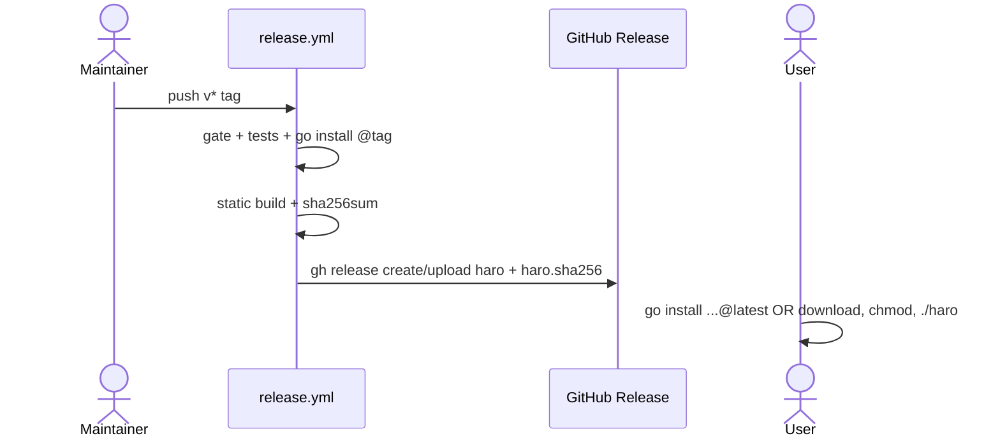

# Design: v2 distribution

## Technical Approach

Use Go’s native module distribution: tagged source makes `go install github.com/HectorCortes/haro@latest` available, while a separate tag-only workflow publishes the root `main.go` program as one stripped, static `haro` GitHub Release asset plus SHA-256 checksum. Ordinary CI gains the F-02 gate and hermetic binary E2E; `internal/project.Init(string) error` remains unchanged because it already performs only local filesystem operations. Strict TDD uses `go test ./...`.

## Architecture Decisions

| Option | Tradeoff | Decision and rationale |
|---|---|---|
| Separate `release.yml` | Extra workflow | Keep ordinary `ci.yml` at `contents: read`; grant `contents: write` only to the publishing job triggered by `v*` tags. |
| GitHub Release + Go module | Two verification paths | The release binary is the distributable artifact; `go install` is the standard installation mechanism. Tags enable Go module resolution automatically, while `gh release` serves users without Go. |
| Plain Go + `gh` | Single platform initially | Avoid GoReleaser/dependencies; `CGO_ENABLED=0 go build -trimpath -ldflags="-s -w" -o dist/haro .` matches the root entry point. |
| Release-only remote install proof | Not run on PRs | Do not run networked `go install` in ordinary CI: proxy/tag timing makes it fragile. The release verify job uses the exact tag with `GOPROXY=direct`; post-release `@latest` remains a documented manual check. |
| Gate under `scripts/` | Shell classification needed | Mirror existing fail-closed boundary scripts and make the root optionally injectable for fixture tests. |
| Binary E2E in `internal/cmd` | Builds once inside test | Keep CLI tests together; execute the real root binary rather than calling `Execute` directly. |
| Preserve D08 wording | Requires interpretation trail | Never rewrite F-01; archive changes only its checkbox/tracking row and records Constitution III.1 mapping. |

## Data Flow



```mermaid
sequenceDiagram
  actor T as E2E
  participant H as built haro
  participant F as empty temp directory
  T->>H: init (cwd=F, GOPROXY=off)
  H->>F: create .haro/config.yaml + four directories
  T->>H: init again
  H->>F: preserve config/user file; exit 0
```

## File Changes and Contracts

| File | Action | Exact design |
|---|---|---|
| `.github/workflows/release.yml` | Create | `on.push.tags: ['v*']`; workflow `contents: read`; `verify` runs gate/tests and clean-`GOBIN` exact-tag install; dependent `release` has `contents: write`, builds `dist/haro`, writes `dist/haro.sha256`, then idempotently `gh release create "$GITHUB_REF_NAME" --verify-tag --generate-notes` and `gh release upload ... --clobber` with `GH_TOKEN`. |
| `.github/workflows/ci.yml` | Modify | Run `./scripts/verify-distribution.sh` in `build-and-test`; retain triggers, three jobs, and read permission. |
| `README.md` | Modify | Replace stale “Go code/go.mod does not exist” status; add Installation with `go install github.com/HectorCortes/haro@latest` and release download executed as `./haro`; retain development test guidance. |
| `scripts/verify-distribution.sh` | Create | `set -euo pipefail`; optional root defaults to repository root. Reject tracked/fallback-discovered `package.json`, `npm-shrinkwrap.json`, and exact lifecycle shell names `preinstall.sh`, `install.sh`, `postinstall.sh`; print hits and exit nonzero, otherwise 0. |
| `internal/cmd/distribution_e2e_test.go` | Create | Build `.` to a temp `haro`; run `init` twice in another `t.TempDir` with `GOPROXY=off`; assert exit 0, all five paths, and preserved config/user bytes. Exercise gate fixtures for clean and rejected inputs. |

## Testing and Traceability

| Requirement | RED proof / design element |
|---|---|
| F-01 | Release workflow exact-tag clean `GOBIN` install; static asset/checksum; manual clean `@latest` smoke check. |
| F-02 | Gate fixture tests reject manifests/hooks and CI invokes the gate. |
| F-03 | Real-binary offline/idempotent temp-project E2E; no production change. |
| TRACE-D08 | Spec/archive maps exactly F-01–F-03 without changing criterion text. |

## Threat Matrix

| Boundary | Applicability | Safe/failure behavior and planned RED test |
|---|---|---|
| Documentation-like paths | Applicable | Allow `requirements.txt`, `CMakeLists.txt`, executable Markdown/MDX, and `README.sh`; reject only exact manifests/hooks. Fixture test covers every class and a failing `install.sh`. |
| Git repository selection | N/A | Workflow is bound to `github.repository`; no user-selected `git -C` or path. |
| Commit state | N/A | No index or commit operation. |
| Push state | N/A | Workflow consumes a pushed tag but performs no push/refspec operation. |
| PR commands | N/A | No PR automation. |

## Risks, Rollout, and Open Questions

Tag/proxy lag is isolated from PR CI by exact-tag direct verification; `@latest` is checked after publication. Job-local write permission and quoted tag/repository values limit release authority. A single runner-platform binary is explicit v2 scope; multi-architecture tooling is deferred. False-positive gate risk is controlled by exact-name classification and adversarial fixtures. No migration or feature flag is required; rollback removes `release.yml` and reverts README/CI wiring. No blocking questions.
