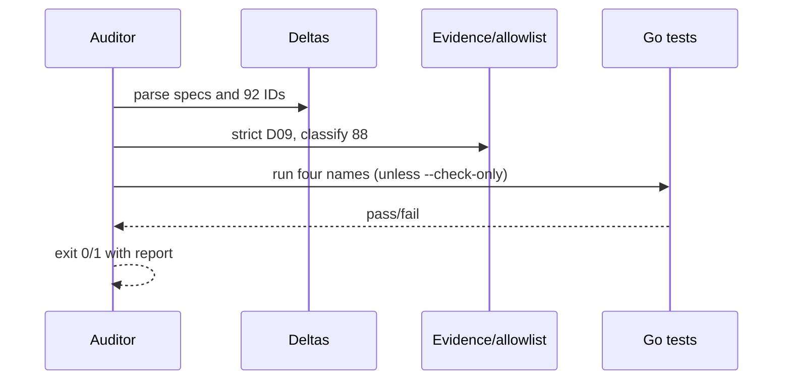

# Design: v2 SDD development flow

## Technical Approach

Update the live contract (`deltas-acceptance.md`, `AGENTS.md`), add a fail-closed Bash traceability gate, and add four repository-property tests in `internal/cmd`. No product code, dependency, `docs/v2/`, or historical archive changes are permitted. Strict TDD uses `go test ./...`; CI retains all Go gates.

## Architecture Decisions

| Option | Tradeoff | Decision and rationale |
|---|---|---|
| Canonical “SDD flow” | Historical linkage | Use only “SDD flow” in live prose; retain “previously `v2-flujo-gentle-ai` (D09)” once in the D09 title. |
| Two-level auditor | Known non-D09 debt | Gate D09; enumerate 88 informational IDs. Exact allowances: `v2-broker/{F-01..F-07,U-01..U-02}` and `v2-ipc/{F-01..F-09,U-01..U-04}` are `deferred:cli-direct`; `v2-no-regresion/{F-01..F-14,U-01..U-03}`, `v2-adapter/{F-01..F-06,U-01..U-04}`, and `v2-path-claims/{F-01..F-07,U-01..U-03}` are `archived-pending`. Unknown debt fails. |
| Script runs tests; tests inspect properties | Recursion risk | Default execution runs four tests. `TestFlowCriterionTraceability` invokes `--check-only`, validating parsing/mapping without Go, preventing recursion and network use. |
| Immutable history | Names differ | Never rewrite archives or `docs/v2/`; the alias preserves searchability and evidence hashes. |

## Exact File Design

| Source line(s) | Result |
|---|---|
| Deltas 5 | `> **Stack decision (locked): Pure Go, no cgo.** SQLite uses modernc.org/sqlite; YAML uses gopkg.in/yaml.v3; ACP remains the adapter protocol standard (see Conventions).` |
| 7,19 | Replace the respective suffixes with `in the SDD flow (see §Usage).` and `(it matches the SDD change name).` |
| 25 | `- **Decided stack — Pure Go, no cgo**: tests: go test ./... (go test ./... -race in CI); gates: go build ./..., go vet ./..., golangci-lint run, govulncheck ./....` |
| 45,492 | IDs become `v2-flujo-sdd`; content becomes `Development flow`; status remains pending until archive. |
| 49–54 | Heading `## Usage — SDD flow`; each spec “is implemented as an **SDD change** in the SDD flow” through seven phases; verification uses `go test ./...` locally and `go test ./... -race` in CI, distinguishes public-boundary E2E from module UNIT/INT, and names all CI gates. |
| 456 | `# Spec: v2-flujo-sdd — Development flow (previously v2-flujo-gentle-ai (D09))` |
| 463 | Replace `gentle-ai flow` with `SDD flow`. |
| 466–467 | Heading becomes `Delivery through the SDD flow`; criterion uses `SDD flow gates`. Current line 466 is an additional provider-named heading. |
| `AGENTS.md:7` | Replace `including gentle-ai/openspec/SDD artifacts` with `including openspec/SDD artifacts`. |
| `scripts/verify-traceability.sh` | Create; `set -euo pipefail`; script-derived default root, optional fixture root; discovery via `git -C "$ROOT"`, `find` fallback. Parse `# Spec: v2-*` and `### (F|U)-[0-9]+`; reject duplicates, malformed sections, or count !=92. Require D09’s exact mappings/functions in `internal/cmd/flow_test.go`. Completed informational specs require archived `spec.md` and `verify-report.md`; only the 59 IDs above are allowlisted. Print each ID/status plus `TOTAL=92 STRICT=4 INFO=88`. Default runs `go test ./internal/cmd -run '^(TestFlowEachSpecIsSDDChange|TestFlowVerificationViaVerify|TestFlowDeliveryThroughGates|TestFlowCriterionTraceability)$'`; `--check-only` skips it. Any parse, evidence, mapping, test, or subprocess error names the ID and exits 1; success exits 0. |
| `internal/cmd/flow_test.go` | Create in package `cmd` with repository-relative helpers and temporary fixtures. |

## Data Flow

`go test` → each property test; U-01 → auditor `--check-only` → parse/classify/map → return, with no recursive Go invocation.

## Testing and Traceability

| Requirement/scenario | Named test and proof |
|---|---|
| F-01 / neutral lifecycle+alias | `TestFlowEachSpecIsSDDChange`: exact live name/alias/cycle and required archived artifact sets. |
| F-02 / Go layers | `TestFlowVerificationViaVerify`: exact race/local runners, E2E-vs-module wording, and CI gate commands; rejects Node/npm in the flow surface. |
| F-03 / hybrid delivery | `TestFlowDeliveryThroughGates`: initiatives paths absent; contract/AGENTS/CI describe review and delivery gates offline. |
| U-01 / allowlisted pass, missing-test failure; TRACE-D09 / complete mapping | `TestFlowCriterionTraceability`: real-root `--check-only`, then temporary relative/absolute and non-git fixtures; asserts 92/4/88 output and that a removed mapping/function fails with its ID. Default auditor execution proves all four pass. |

## Threat Matrix

| Boundary | Applicability | Safe/failure behavior and RED test |
|---|---|---|
| Documentation-like paths | N/A | No executable-file classification. |
| Git repository selection | Applicable | Root is explicit or script-derived and quoted; relative, absolute, foreign-cwd, and non-git fallback fixtures must resolve deterministically or fail, covered by U-01. |
| Commit state | N/A | No index/commit operation. |
| Push state | N/A | No push/ref resolution. |
| PR commands | N/A | No PR automation. |

## Risks, Rollout, and Open Questions

Grammar, count checks, and fixtures mitigate Markdown coupling. Unknown allowances fail closed. Tests avoid mutable GitHub state; receipts remain verify-report evidence. Scoped assertions protect other specs. No migration; rollback reverts two documents and removes two files. No blocking questions.
